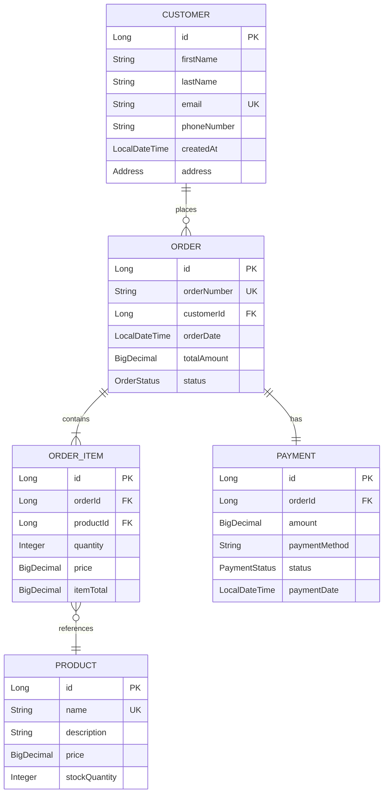
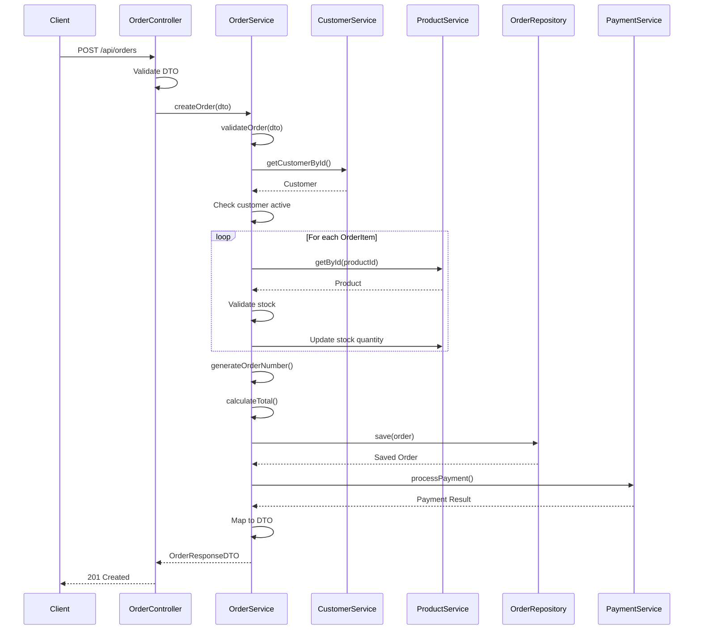
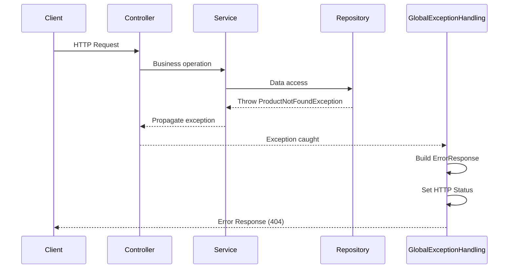

## 🗄️ Database Schema

### Entity Relationships

```mermaid
erDiagram
    CUSTOMER ||--o{ ORDER : places
    CUSTOMER {
        Long id PK
        String firstName
        String lastName
        String email UK
        String phoneNumber
        LocalDateTime createdAt
        Address address
    }
    
    ORDER ||--|{ ORDER_ITEM : contains
    ORDER ||--|| PAYMENT : has
    ORDER {
        Long id PK
        String orderNumber UK
        Long customerId FK
        LocalDateTime orderDate
        BigDecimal totalAmount
        OrderStatus status
    }
    
    ORDER_ITEM }o--|| PRODUCT : references
    ORDER_ITEM {
        Long id PK
        Long orderId FK
        Long productId FK
        Integer quantity
        BigDecimal price
        BigDecimal itemTotal
    }
    
    PRODUCT {
        Long id PK
        String name UK
        String description
        BigDecimal price
        Integer stockQuantity
    }
    
    PAYMENT {
        Long id PK
        Long orderId FK
        BigDecimal amount
        String paymentMethod
        PaymentStatus status
        LocalDateTime paymentDate
    }
```

## 📊 Data Flow Diagrams

### Order Creation Flow

```mermaid
sequenceDiagram
    participant Client
    participant OrderController
    participant OrderService
    participant CustomerService
    participant ProductService
    participant OrderRepository
    participant PaymentService
    
    Client->>OrderController: POST /api/orders
    OrderController->>OrderController: Validate DTO
    OrderController->>OrderService: createOrder(dto)
    
    OrderService->>OrderService: validateOrder(dto)
    OrderService->>CustomerService: getCustomerById()
    CustomerService-->>OrderService: Customer
    
    OrderService->>OrderService: Check customer active
    
    loop For each OrderItem
        OrderService->>ProductService: getById(productId)
        ProductService-->>OrderService: Product
        OrderService->>OrderService: Validate stock
        OrderService->>ProductService: Update stock quantity
    end
    
    OrderService->>OrderService: generateOrderNumber()
    OrderService->>OrderService: calculateTotal()
    OrderService->>OrderRepository: save(order)
    OrderRepository-->>OrderService: Saved Order
    
    OrderService->>PaymentService: processPayment()
    PaymentService-->>OrderService: Payment Result
    
    OrderService->>OrderService: Map to DTO
    OrderService-->>OrderController: OrderResponseDTO
    OrderController-->>Client: 201 Created
```

### Exception Handling Flow

```mermaid
sequenceDiagram
    participant Client
    participant Controller
    participant Service
    participant Repository
    participant GlobalExceptionHandling
    
    Client->>Controller: HTTP Request
    Controller->>Service: Business operation
    Service->>Repository: Data access
    Repository-->>Service: Throw ProductNotFoundException
    Service-->>Controller: Propagate exception
    Controller-->>GlobalExceptionHandling: Exception caught
    GlobalExceptionHandling->>GlobalExceptionHandling: Build ErrorResponse
    GlobalExceptionHandling->>GlobalExceptionHandling: Set HTTP Status
    GlobalExceptionHandling-->>Client: Error Response (404)
```

