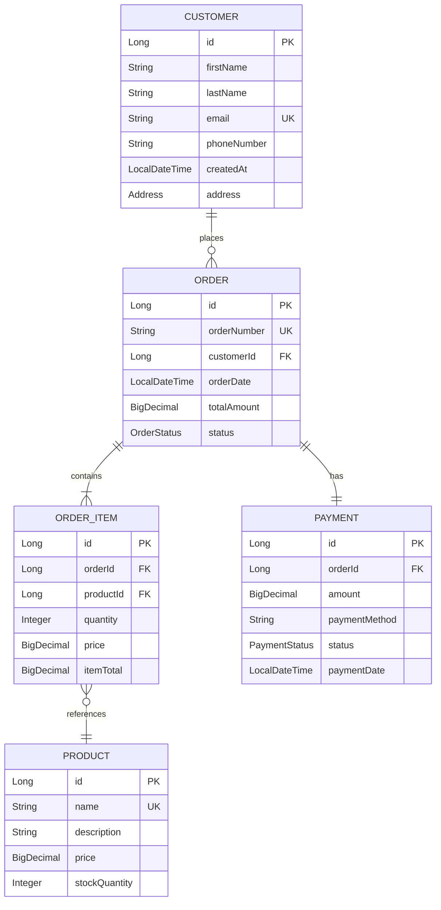
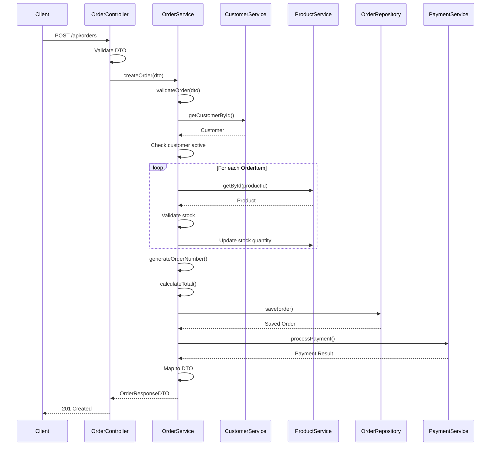
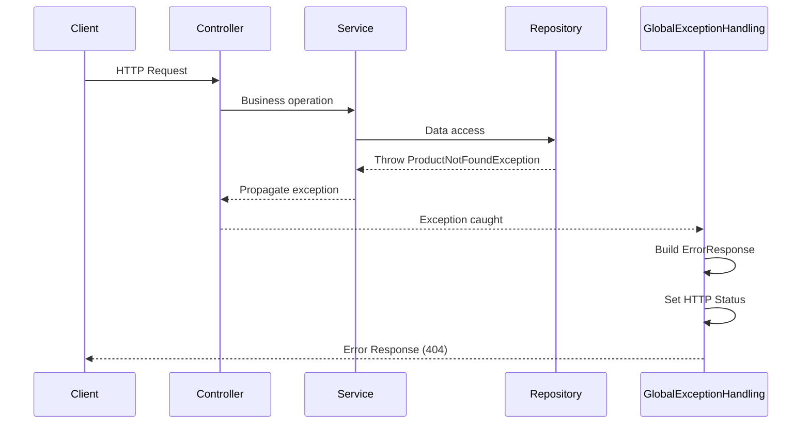

# E-Commerce REST API - Comprehensive Index Plan

**Author**: Alaa Mohamed  
**Date**: December 7, 2025  
**Project Version**: 0.0.1-SNAPSHOT  
**Spring Boot Version**: 3.5.7  
**Java Version**: 17

---

## 📋 Table of Contents

1. [Executive Summary](#-executive-summary)
2. [Technology Stack](#-technology-stack)
3. [Project Architecture](#-project-architecture)
4. [Layer-by-Layer Index](#-layer-by-layer-index)
5. [Database Schema](#-database-schema)
6. [API Endpoint Inventory](#-api-endpoint-inventory)
7. [Data Flow Diagrams](#-data-flow-diagrams)
8. [Security Considerations](#-security-considerations)
9. [Development Roadmap](#-development-roadmap)
10. [Code Quality Assessment](#-code-quality-assessment)
11. [Deployment Strategy](#-deployment-strategy)
12. [Testing Strategy](#-testing-strategy)
13. [Performance Optimization](#-performance-optimization)
14. [Documentation Index](#-documentation-index)
15. [Developer Onboarding Guide](#-developer-onboarding-guide)

---

## 📊 Executive Summary

### Project Overview

The **E-Commerce REST API** is a Spring Boot-based backend application designed to manage an e-commerce platform's core functionalities including customer management, product catalog, order processing, and payment handling.

**Architecture Pattern**: 3-Tier Layered Architecture (Clean Architecture)  
**Primary Use Case**: Backend API for an e-commerce application  
**Database**: Oracle Database  
**ORM**: Hibernate/JPA

### Key Features

- ✅ **Customer Management**: Registration, profile updates, order history
- ✅ **Product Catalog**: CRUD operations, search, filtering, stock management
- ✅ **Order Processing**: Multi-item orders, status tracking, order validation
- ✅ **Payment Integration**: Multiple payment strategies (Stripe, Wallet)
- ✅ **Exception Handling**: Comprehensive error handling with custom exceptions
- ✅ **Data Validation**: Jakarta Bean Validation integration
- ✅ **DTO Mapping**: MapStruct for entity-DTO conversions

### Project Health Score: **B+ (85/100)**

| Category | Score | Status |
|----------|-------|--------|
| Architecture | 88/100 | ✅ Good |
| Code Quality | 82/100 | ⚠️ Needs Improvement |
| Documentation | 78/100 | ⚠️ Needs Improvement |
| Testing | 40/100 | 🔴 Critical |
| Security | 60/100 | ⚠️ Needs Improvement |
| Performance | 75/100 | ⚠️ Needs Improvement |

---

## 🛠️ Technology Stack

### Core Framework

| Technology | Version | Purpose |
|------------|---------|---------|
| **Spring Boot** | 3.5.7 | Application framework |
| **Java** | 17 | Programming language |
| **Maven** | 4.0.0 | Build tool |

### Spring Ecosystem

- **Spring Boot Starter Web**: REST API development
- **Spring Boot Starter Data JPA**: Database access and ORM
- **Spring Boot Starter Validation**: Bean validation
- **Spring Boot Configuration Processor**: Configuration metadata

### Database

| Component | Details |
|-----------|---------|
| **Database** | Oracle Database |
| **JDBC Driver** | Oracle JDBC 11 (ojdbc11) |
| **Connection URL** | `jdbc:oracle:thin:@//localhost:1521/orclpdb` |
| **Schema** | hr (development) |
| **DDL Strategy** | create (⚠️ Development only) |

### Libraries & Tools

| Library | Version | Purpose |
|---------|---------|---------|
| **Lombok** | - | Boilerplate reduction |
| **MapStruct** | 1.5.3.Final | Object mapping |
| **Stripe Java SDK** | 24.0.0 | Payment processing |
| **Hibernate** | - (via Spring Boot) | ORM |

### Build Configuration

- **Annotation Processors**: Lombok, MapStruct, Spring Boot Configuration Processor
- **JDBC Batching**: Enabled (batch_size: 50)
- **Order Inserts/Updates**: Enabled for better performance

---

## 🏗️ Project Architecture

### High-Level Architecture

```
┌─────────────────────────────────────────────────────────┐
│                    CLIENT LAYER                          │
│              (Frontend / Mobile / API Clients)           │
└───────────────────────┬─────────────────────────────────┘
                        │ HTTP/REST
┌───────────────────────▼─────────────────────────────────┐
│                  CONTROLLER LAYER                        │
│   (REST Endpoints, Request Validation, Response)        │
│   • CustomerController  • ProductController              │
│   • OrderController     • OrderItemController            │
└───────────────────────┬─────────────────────────────────┘
                        │ DTOs
┌───────────────────────▼─────────────────────────────────┐
│                   SERVICE LAYER                          │
│   (Business Logic, Validation, Orchestration)           │
│   • CustomerService  • ProductService                    │
│   • OrderService     • PaymentService                    │
└───────────────────────┬─────────────────────────────────┘
                        │ Entities
┌───────────────────────▼─────────────────────────────────┐
│                 REPOSITORY LAYER                         │
│   (Data Access, Custom Queries, JPQL)                   │
│   • CustomerRepository  • ProductRepository              │
│   • OrderRepository     • PaymentRepository              │
└───────────────────────┬─────────────────────────────────┘
                        │ SQL/JDBC
┌───────────────────────▼─────────────────────────────────┐
│                  DATABASE LAYER                          │
│              (Oracle Database - orclpdb)                 │
└─────────────────────────────────────────────────────────┘
```

### Cross-Cutting Concerns

```
┌──────────────────┐  ┌──────────────────┐  ┌──────────────────┐
│  Exception       │  │  DTO Mapping     │  │  Payment         │
│  Handling        │  │  (MapStruct)     │  │  Strategy        │
│  (@ControllerAdvice) │  (Entity ↔ DTO) │  │  (Stripe/Wallet) │
└──────────────────┘  └──────────────────┘  └──────────────────┘
```

### Package Structure

```
com.e_commerce.E_Commerce.REST.API
│
├── controller/                 # REST controllers (4 classes)
├── service/                    # Business logic (5 classes)
├── repository/                 # Data access (5 interfaces)
├── model/                      # JPA entities (6 classes + 2 enums)
├── dto/                        # Data Transfer Objects
│   ├── request/                # Input DTOs (10 classes)
│   └── response/               # Output DTOs (6 classes)
├── mapper/                     # MapStruct mappers (5 interfaces)
├── exception/                  # Exception hierarchy (18 classes)
│   ├── customer/               # Customer exceptions
│   ├── order/                  # Order exceptions
│   ├── orderItem/              # OrderItem exceptions
│   ├── payment/                # Payment exceptions
│   └── product/                # Product exceptions
├── payment/                    # Payment strategies (4 classes)
└── ECommerceRestApiApplication.java  # Main class
```

---

## 📂 Layer-by-Layer Index

### 1. Controller Layer

**Purpose**: Handle HTTP requests/responses, request validation, and route to appropriate services

| Controller | Path | Endpoints | Status | Issues |
|------------|------|-----------|--------|--------|
| [CustomerController](file:///c:/Users/alaa/Desktop/E-Commerce-REST-API/src/main/java/com/e_commerce/E_Commerce/REST/API/controller/CustomerController.java) | `/api/customers` | 5 | ⚠️ | Debug code, inconsistent response wrapping |
| [OrderController](file:///c:/Users/alaa/Desktop/E-Commerce-REST-API/src/main/java/com/e_commerce/E_Commerce/REST/API/controller/OrderController.java) | `/api/orders` | 6 | ⚠️ | Unused imports |
| [ProductController](file:///c:/Users/alaa/Desktop/E-Commerce-REST-API/src/main/java/com/e_commerce/E_Commerce/REST/API/controller/ProductController.java) | `/api/products` | 8 | ⚠️ | Duplicate mappings |
| [OrderItemController](file:///c:/Users/alaa/Desktop/E-Commerce-REST-API/src/main/java/com/e_commerce/E_Commerce/REST/API/controller/OrderItemController.java) | `/api/order-items` | 0 | 🔴 | **Empty controller** |

**Common Issues**:
- ❌ No pagination support for list endpoints
- ❌ Missing API documentation (OpenAPI/Swagger)
- ❌ Inconsistent use of `ResponseEntity`
- ❌ No rate limiting or throttling
- ❌ Missing CORS configuration

### 2. Service Layer

**Purpose**: Business logic, validation, transaction management

| Service | Methods | Transaction Support | Score |
|---------|---------|---------------------|-------|
| [CustomerService](file:///c:/Users/alaa/Desktop/E-Commerce-REST-API/src/main/java/com/e_commerce/E_Commerce/REST/API/service/CustomerService.java) | 5 | ✅ @Transactional | 90/100 |
| [OrderService](file:///c:/Users/alaa/Desktop/E-Commerce-REST-API/src/main/java/com/e_commerce/E_Commerce/REST/API/service/OrderService.java) | 7 | ✅ @Transactional | 92/100 |
| [ProductService](file:///c:/Users/alaa/Desktop/E-Commerce-REST-API/src/main/java/com/e_commerce/E_Commerce/REST/API/service/ProductService.java) | 7 | ✅ @Transactional | 88/100 |
| [OrderItemService](file:///c:/Users/alaa/Desktop/E-Commerce-REST-API/src/main/java/com/e_commerce/E_Commerce/REST/API/service/OrderItemService.java) | ? | ? | - |
| [PaymentService](file:///c:/Users/alaa/Desktop/E-Commerce-REST-API/src/main/java/com/e_commerce/E_Commerce/REST/API/service/PaymentService.java) | ? | ? | - |

**Critical Issues**:
- 🔴 No service interfaces (tight coupling)
- 🔴 Business logic leaking into DTOs
- ⚠️ Complex methods need refactoring (OrderService.createOrder)
- ⚠️ No caching strategy
- ⚠️ Missing pagination support

**Best Practices Found**:
- ✅ Constructor injection
- ✅ Transaction management
- ✅ Custom exception throwing
- ✅ Helper methods for complex operations

### 3. Repository Layer

**Purpose**: Data access abstraction, custom queries

| Repository | Custom Methods | JPQL Queries | Features |
|------------|----------------|--------------|----------|
| [CustomerRepository](file:///c:/Users/alaa/Desktop/E-Commerce-REST-API/src/main/java/com/e_commerce/E_Commerce/REST/API/repository/CustomerRepository.java) | 2 | 0 | Email lookup, exists check |
| [OrderRepository](file:///c:/Users/alaa/Desktop/E-Commerce-REST-API/src/main/java/com/e_commerce/E_Commerce/REST/API/repository/OrderRepository.java) | 7 | 4 | JOIN FETCH, N+1 prevention |
| [ProductRepository](file:///c:/Users/alaa/Desktop/E-Commerce-REST-API/src/main/java/com/e_commerce/E_Commerce/REST/API/repository/ProductRepository.java) | 3 | 0 | Name lookup, exists check |
| [OrderItemRepository](file:///c:/Users/alaa/Desktop/E-Commerce-REST-API/src/main/java/com/e_commerce/E_Commerce/REST/API/repository/OrderItemRepository.java) | ? | ? | - |
| [PaymentRepository](file:///c:/Users/alaa/Desktop/E-Commerce-REST-API/src/main/java/com/e_commerce/E_Commerce/REST/API/repository/PaymentRepository.java) | ? | ? | - |

**Strengths**:
- ✅ Proper use of Spring Data JPA
- ✅ Custom JPQL queries with JOIN FETCH
- ✅ Method naming conventions followed

**Improvement Areas**:
- ⚠️ No pagination support in custom methods
- ⚠️ No JpaSpecificationExecutor for dynamic queries
- ⚠️ Missing database indexes definition
- ⚠️ No query hints for optimization

### 4. Model/Entity Layer

**Purpose**: Domain entities mapped to database tables

| Entity | Relationships | Key Features | Issues |
|--------|---------------|--------------|--------|
| [Customer](file:///c:/Users/alaa/Desktop/E-Commerce-REST-API/src/main/java/com/e_commerce/E_Commerce/REST/API/model/Customer.java) | @OneToMany Order | @Embedded Address | 🔴 Broken getSisze() method |
| [Order](file:///c:/Users/alaa/Desktop/E-Commerce-REST-API/src/main/java/com/e_commerce/E_Commerce/REST/API/model/Order.java) | @ManyToOne Customer, @OneToMany OrderItem | OrderStatus enum | ⚠️ Missing audit fields |
| [Product](file:///c:/Users/alaa/Desktop/E-Commerce-REST-API/src/main/java/com/e_commerce/E_Commerce/REST/API/model/Product.java) | @OneToMany OrderItem | Stock management | ⚠️ No version field |
| [OrderItem](file:///c:/Users/alaa/Desktop/E-Commerce-REST-API/src/main/java/com/e_commerce/E_Commerce/REST/API/model/OrderItem.java) | @ManyToOne Order, Product | Quantity, price | - |
| [Payment](file:///c:/Users/alaa/Desktop/E-Commerce-REST-API/src/main/java/com/e_commerce/E_Commerce/REST/API/model/Payment.java) | @OneToOne Order | PaymentStatus enum | - |
| [Address](file:///c:/Users/alaa/Desktop/E-Commerce-REST-API/src/main/java/com/e_commerce/E_Commerce/REST/API/model/Address.java) | @Embeddable | Value object | - |

**Enumerations**:
- `OrderStatus`: PENDING, PROCESSING, SHIPPED, DELIVERED, CANCELLED
- `PaymentStatus`: PENDING, COMPLETED, FAILED, REFUNDED

**Critical Issues**:
- 🔴 `Customer.getSisze()` uses `Long.getLong()` incorrectly (returns null!)
- 🔴 Computed field initialization issues
- ⚠️ Missing audit fields (createdAt, updatedAt, createdBy, updatedBy)
- ⚠️ No optimistic locking (@Version)
- ⚠️ Lombok @Data issues with equals/hashCode

### 5. DTO Layer

**Purpose**: API contracts for request/response

#### Request DTOs (10 classes)

| DTO | Validation | Issues |
|-----|------------|--------|
| CustomerCreateRequestDTO | ✅ Regex, @NotBlank | 🔴 Business logic methods |
| CustomerUpdateReqDTO | ✅ | - |
| OrderCreateRequestDTO | ✅ | 🔴 validateOrder(), calculateTotalAmount() |
| OrderUpdateRequestDTO | ✅ | - |
| ProductCreateRequestDTO | ✅ @Positive, @NotNull | ⚠️ Data mutation methods |
| ProductUpdateRequestDTO | ✅ | - |
| OrderItemCreateRequestDTO | ✅ | - |
| OrderItemUpdateRequestDTO | ✅ | - |
| PaymentRequestDTO | ✅ | - |
| AddressRequestDTO | ✅ | - |

#### Response DTOs (6 classes - Records)

| DTO | Immutable | Helper Methods |
|-----|-----------|----------------|
| CustomerResponseDTO | ✅ Record | getFullName(), hasOrders() |
| OrderResponseDTO | ✅ Record | - |
| ProductResponseDTO | ✅ Record | - |
| OrderItemResponseDTO | ✅ Record | - |
| PaymentResponseDTO | ✅ Record | - |
| AddressResponseDTO | ✅ Record | - |

**Issues**:
- 🔴 Business logic in DTOs (violates SRP)
- 🔴 Data mutation methods (should be immutable)
- ⚠️ No validation groups
- ⚠️ Duplicate regex patterns

### 6. Mapper Layer

**Purpose**: Entity ↔ DTO conversion using MapStruct

| Mapper | Strategy | Score |
|--------|----------|-------|
| [CustomerMapper](file:///c:/Users/alaa/Desktop/E-Commerce-REST-API/src/main/java/com/e_commerce/E_Commerce/REST/API/mapper/CustomerMapper.java) | Interface + default methods | 92/100 |
| [OrderMapper](file:///c:/Users/alaa/Desktop/E-Commerce-REST-API/src/main/java/com/e_commerce/E_Commerce/REST/API/mapper/OrderMapper.java) | Interface + default methods | 93/100 |
| [ProductMapper](file:///c:/Users/alaa/Desktop/E-Commerce-REST-API/src/main/java/com/e_commerce/E_Commerce/REST/API/mapper/ProductMapper.java) | Interface | - |
| [OrderItemMapper](file:///c:/Users/alaa/Desktop/E-Commerce-REST-API/src/main/java/com/e_commerce/E_Commerce/REST/API/mapper/OrderItemMapper.java) | Interface | - |
| [PaymentMapper](file:///c:/Users/alaa/Desktop/E-Commerce-REST-API/src/main/java/com/e_commerce/E_Commerce/REST/API/mapper/PaymentMapper.java) | Interface | - |

**Configuration**: All use `@Mapper(componentModel = "spring")`

**Improvement Areas**:
- Use `NullValuePropertyMappingStrategy.IGNORE`
- Add `unmappedTargetPolicy = ReportingPolicy.ERROR`
- Create global mapper configuration

### 7. Exception Layer

**Purpose**: Centralized error handling

#### Exception Hierarchy

```
BusinessException (Base)
├── ResourceNotFoundException
├── DuplicateResourceException
├── ValidationException
└── Domain-Specific Exceptions
    ├── customer/
    │   ├── CustomerNotFoundException
    │   └── CustomerInactiveException
    ├── order/
    │   ├── OrderNotFoundException
    │   ├── OrderAlreadyProcessedException
    │   └── OrderTotalInvalidException
    ├── orderItem/
    │   └── OrderItemsEmptyException
    ├── payment/
    │   └── PaymentAmountMismatchException
    └── product/
        ├── ProductNotFoundException
        ├── InsufficientStockException
        ├── ProductOutOfStockException
        └── ProductQuantityExceedException
```

**Supporting Classes**:
- `GlobalExceptionHandling` (@RestControllerAdvice)
- `ErrorResponse` (Standardized response)
- `ErrorCode` (Enumeration)

**Score**: 90/100

**Strengths**:
- ✅ Centralized handling
- ✅ Custom exceptions
- ✅ ErrorCode enum
- ✅ Consistent error response

**Improvements Needed**:
- Add logging
- Add trace ID for debugging
- Reduce exception class explosion

### 8. Payment Layer

**Purpose**: Payment processing with Strategy pattern

| Class | Type | Purpose |
|-------|------|---------|
| PaymentStrategy | Interface | Strategy pattern interface |
| CreditCardPaymentStrategy | Interface | Credit card processing |
| CashWalletPaymentStrategy | Implementation | Wallet payments |
| StripePayment | Implementation | Stripe gateway integration |

**Pattern**: Strategy Pattern for extensible payment methods

---

## 🗄️ Database Schema

### Entity Relationships



### Database Configuration

```yaml
Database: Oracle Database
Connection: jdbc:oracle:thin:@//localhost:1521/orclpdb
Schema: hr
DDL Strategy: create (⚠️ WARNING: Drops and recreates tables on startup)
Optimizations:
  - JDBC Batching: Enabled (batch_size: 50)
  - Order Inserts: true
  - Order Updates: true
```

> [!CAUTION]
> **DDL Auto Set to 'create'**: This will DROP all tables on application restart!  
> Change to `ddl-auto: validate` or `update` for production.

---

## 🌐 API Endpoint Inventory

### Customer API

**Base Path**: `/api/customers`

| Method | Endpoint | Description | Request Body | Response | Status |
|--------|----------|-------------|--------------|----------|--------|
| POST | `/` | Create customer | CustomerCreateRequestDTO | CustomerResponseDTO | 201 |
| GET | `/{id}` | Get customer by ID | - | CustomerResponseDTO | 200 |
| PUT | `/{id}` | Update customer | CustomerUpdateReqDTO | CustomerResponseDTO | 200 |
| GET | `/` | Get all customers | - | List\<CustomerResponseDTO\> | 200 |
| GET | `/email` | Find by email | ?email={email} | CustomerResponseDTO | 200 |

### Product API

**Base Path**: `/api/products`

| Method | Endpoint | Description | Request Body | Response | Status |
|--------|----------|-------------|--------------|----------|--------|
| POST | `/` | Create product | ProductCreateRequestDTO | ProductResponseDTO | 201 |
| GET | `/{id}` | Get product by ID | - | ProductResponseDTO | 200 |
| PUT | `/{id}` | Update product | ProductUpdateRequestDTO | ProductResponseDTO | 200 |
| DELETE | `/{id}` | Delete product | - | - | 204 |
| GET | `/` | Get all products | - | List\<ProductResponseDTO\> | 200 |
| GET | `/search` | Search by name | ?name={name} | List\<ProductResponseDTO\> | 200 |
| GET | `/price-range` | Filter by price | ?min={min}&max={max} | List\<ProductResponseDTO\> | 200 |
| GET | `/` | Get all (duplicate?) | - | List\<ProductResponseDTO\> | 200 |

### Order API

**Base Path**: `/api/orders`

| Method | Endpoint | Description | Request Body | Response | Status |
|--------|----------|-------------|--------------|----------|--------|
| POST | `/` | Create order | OrderCreateRequestDTO | OrderResponseDTO | 201 |
| GET | `/{id}` | Get order by ID | - | OrderResponseDTO | 200 |
| PATCH | `/{id}/status` | Update order status | OrderUpdateRequestDTO | OrderResponseDTO | 200 |
| GET | `/customer/{customerId}` | Get customer orders | - | List\<OrderResponseDTO\> | 200 |
| GET | `/` | Get all orders | - | List\<OrderResponseDTO\> | 200 |
| GET | `/status/{status}` | Filter by status | - | List\<OrderResponseDTO\> | 200 |

### OrderItem API

**Base Path**: `/api/order-items`

| Status | Description |
|--------|-------------|
| ⚠️ EMPTY | Controller exists but has no implemented endpoints |

> [!WARNING]
> OrderItemController is empty and needs implementation!

---

## 📊 Data Flow Diagrams

### Order Creation Flow



### Exception Handling Flow



---

## 🔒 Security Considerations

### Current State: ⚠️ MINIMAL SECURITY

| Security Aspect | Status | Risk Level |
|----------------|--------|------------|
| Authentication | ❌ Not Implemented | 🔴 Critical |
| Authorization | ❌ Not Implemented | 🔴 Critical |
| Password Encryption | ❌ No password field | 🔴 Critical |
| HTTPS/TLS | ❌ Not configured | 🔴 Critical |
| CORS | ❌ Not configured | ⚠️ High |
| SQL Injection | ✅ JPA protects | ✅ Low |
| Rate Limiting | ❌ Not implemented | ⚠️ Medium |
| Input Validation | ✅ Bean Validation | ✅ Good |
| Database Credentials | ⚠️ Hardcoded in YAML | 🔴 Critical |

### Critical Security Issues

> [!CAUTION]
> **No Authentication/Authorization**: Anyone can access all endpoints!

**Immediate Action Required**:

1. **Add Spring Security**:
```xml
<dependency>
    <groupId>org.springframework.boot</groupId>
    <artifactId>spring-boot-starter-security</artifactId>
</dependency>
```

2. **Implement JWT Authentication**
3. **Add Role-Based Access Control (RBAC)**
4. **Move credentials to environment variables**
5. **Enable HTTPS**
6. **Add CORS configuration**
7. **Implement rate limiting**

---

## 🗺️ Development Roadmap

### Phase 1: Critical Fixes (Week 1-2)

#### High Priority
- [ ] Fix `Customer.getSisze()` method
- [ ] Implement OrderItemController endpoints
- [ ] Remove debug statements (System.out.println)
- [ ] Change DDL auto to `validate` or `update`
- [ ] Add Spring Security with JWT
- [ ] Move credentials to environment variables

#### Medium Priority
- [ ] Add service interfaces
- [ ] Implement pagination for all list endpoints
- [ ] Add OpenAPI/Swagger documentation
- [ ] Standardize ResponseEntity usage
- [ ] Clean up unused imports

### Phase 2: Architecture Improvements (Week 3-4)

- [ ] Move business logic from DTOs to services
- [ ] Add audit fields to entities (@CreatedDate, @LastModifiedDate)
- [ ] Add optimistic locking (@Version)
- [ ] Implement global mapper configuration
- [ ] Add validation groups for CREATE vs UPDATE
- [ ] Create custom validation annotations

### Phase 3: Performance & Scalability (Week 5-6)

- [ ] Implement caching strategy (Spring Cache)
- [ ] Add database indexes
- [ ] Implement JpaSpecificationExecutor for dynamic queries
- [ ] Add @EntityGraph for complex queries
- [ ] Optimize JPQL queries
- [ ] Add query hints

### Phase 4: Quality & Testing (Week 7-8)

- [ ] Write unit tests (target: 80% coverage)
- [ ] Write integration tests
- [ ] Add API tests with RestAssured
- [ ] Implement soft delete pattern
- [ ] Add health checks and metrics
- [ ] Add logging framework (SLF4J + Logback)

### Phase 5: Production Readiness (Week 9-10)

#### Feature Enhancements
- [ ] Implement email notifications
- [ ] Add order tracking
- [ ] Implement inventory alerts
- [ ] Add reporting endpoints
- [ ] Implement webhook support for payments

#### DevOps
- [ ] Add Docker support
- [ ] Create CI/CD pipeline
- [ ] Add monitoring (Prometheus, Grafana)
- [ ] Implement distributed tracing
- [ ] Add rate limiting per user
- [ ] Create deployment documentation

---

## 📈 Code Quality Assessment

### Metrics

| Metric | Value | Target | Status |
|--------|-------|--------|--------|
| Total Classes | ~60 | - | - |
| Lines of Code | ~5000 (estimated) | - | - |
| Test Coverage | 0% | 80% | 🔴 |
| Cyclomatic Complexity | Medium-High | Low | ⚠️ |
| Code Duplication | Low | Low | ✅ |
| Comment Coverage | Low | 20% | ⚠️ |

### Code Smells

#### Critical Issues (Fix Immediately)

1. **Broken Logic in Customer.getSisze()**
   - File: [Customer.java:52-58](file:///c:/Users/alaa/Desktop/E-Commerce-REST-API/src/main/java/com/e_commerce/E_Commerce/REST/API/model/Customer.java#L52-L58)
   - Issue: `Long.getLong()` returns null
   - Fix: Use `(long) orderList.size()`

2. **Empty Controller**
   - File: [OrderItemController.java](file:///c:/Users/alaa/Desktop/E-Commerce-REST-API/src/main/java/com/e_commerce/E_Commerce/REST/API/controller/OrderItemController.java)
   - Issue: No endpoints implemented
   - Impact: Missing functionality

3. **Business Logic in DTOs**
   - Files: OrderCreateRequestDTO, CustomerCreateRequestDTO
   - Issue: DTOs contain validation and calculation logic
   - Impact: Violates Single Responsibility Principle

#### Major Issues (Fix Soon)

4. **No Service Interfaces**
   - Location: All service classes
   - Issue: Tight coupling, hard to mock
   - Impact: Violates Dependency Inversion Principle

5. **Missing Pagination**
   - Location: All controllers
   - Issue: Can't handle large datasets
   - Impact: Performance issues, potential OOM

6. **No Tests**
   - Impact: No safety net for refactoring
   - Risk: High chance of regression bugs

### Design Patterns Used

✅ **Good Patterns**:
- Strategy Pattern (Payment strategies)
- Repository Pattern (Spring Data JPA)
- DTO Pattern (Request/Response separation)
- Builder Pattern (via Lombok)

⚠️ **Missing Patterns**:
- Factory Pattern (for entity creation)
- Observer Pattern (for event handling)
- Specification Pattern (for dynamic queries)

---

## 🚀 Deployment Strategy

### Environment Configuration

```
Development  →  Staging  →  Production
   (Local)    (Test Data)   (Real Data)
```

### Configuration Profiles

Create separate application-{profile}.yaml:

```
application.yaml          # Common configuration
application-dev.yaml      # Development settings
application-staging.yaml  # Staging environment
application-prod.yaml     # Production environment
```

### Deployment Checklist

> [!WARNING]
> **Before Deploying to Production**:

- [ ] Change `ddl-auto` from `create` to `validate`
- [ ] Move database credentials to environment variables
- [ ] Enable HTTPS
- [ ] Add Spring Security
- [ ] Configure logging to files
- [ ] Set up monitoring and alerts
- [ ] Create database backups
- [ ] Add health check endpoint
- [ ] Configure proper CORS
- [ ] Enable rate limiting
- [ ] Review and minimize logged sensitive data
- [ ] Set up centralized logging
- [ ] Configure proper error pages

### Docker Support (Recommended)

```dockerfile
FROM openjdk:17-jdk-alpine
WORKDIR /app
COPY target/E-Commerce-REST-API-0.0.1-SNAPSHOT.jar app.jar
EXPOSE 8080
ENTRYPOINT ["java","-jar","/app/app.jar"]
```

---

## 🧪 Testing Strategy

### Current State: 🔴 NO TESTS

**Test Coverage**: 0%  
**Target**: 80%+

### Testing Pyramid

```
                     /\
                    /  \  E2E Tests (10%)
                   /____\
                  /      \  Integration Tests (30%)
                 /________\
                /          \  Unit Tests (60%)
               /__________  \
```

### Test Plan

#### 1. Unit Tests (Target: 60% of all tests)

**Service Layer Tests**:
```java
@ExtendWith(MockitoExtension.class)
class CustomerServiceTest {
    @Mock private CustomerRepository customerRepository;
    @Mock private CustomerMapper customerMapper;
    @InjectMocks private CustomerService customerService;
    
    @Test
    void shouldCreateCustomer_WhenValidData() { }
    
    @Test
    void shouldThrowException_WhenDuplicateEmail() { }
}
```

**Mapper Tests**:
```java
@SpringBootTest
class CustomerMapperTest {
    @Autowired private CustomerMapper customerMapper;
    
    @Test
    void shouldMapEntityToDTO() { }
}
```

#### 2. Integration Tests (Target: 30%)

**Repository Tests**:
```java
@DataJpaTest
class CustomerRepositoryTest {
    @Autowired private CustomerRepository repository;
    
    @Test
    void shouldFindCustomerByEmail() { }
}
```

**Controller Tests**:
```java
@WebMvcTest(CustomerController.class)
class CustomerControllerTest {
    @Autowired private MockMvc mockMvc;
    @MockBean private CustomerService customerService;
    
    @Test
    void shouldCreateCustomer() throws Exception {
        mockMvc.perform(post("/api/customers")
            .contentType(MediaType.APPLICATION_JSON)
            .content("..."))
            .andExpect(status().isCreated());
    }
}
```

#### 3. End-to-End Tests (Target: 10%)

Using RestAssured:
```java
@SpringBootTest(webEnvironment = RANDOM_PORT)
class OrderE2ETest {
    @LocalServerPort private int port;
    
    @Test
    void shouldCreateCompleteOrder() {
        given()
            .port(port)
            .contentType(JSON)
            .body(orderRequest)
        .when()
            .post("/api/orders")
        .then()
            .statusCode(201);
    }
}
```

### Test Data Strategy

- Use TestContainers for database
- Use in-memory H2 for unit tests
- Create test data builders
- Use @Sql scripts for integration tests

---

## ⚡ Performance Optimization

### Current Bottlenecks

| Issue | Location | Impact | Priority |
|-------|----------|--------|----------|
| N+1 Queries | Order fetching | High latency | 🔴 High |
| No Caching | Product API | Unnecessary DB hits | ⚠️ Medium |
| Full Table Scans | All list endpoints | Slow with large data | ⚠️ Medium |
| Lazy Loading Issues | Entity relationships | LazyInitializationException | ⚠️ Medium |

### Optimization Strategies

#### 1. Database Optimization

**Add Indexes**:
```java
@Table(name = "customers", indexes = {
    @Index(name = "idx_email", columnList = "email", unique = true),
    @Index(name = "idx_phone", columnList = "phone_number")
})
```

**Query Optimization**:
- ✅ Already using JOIN FETCH in OrderRepository
- Add @EntityGraph for complex queries
- Use DTO projections for read-only queries

#### 2. Caching Strategy

```java
@Configuration
@EnableCaching
public class CacheConfig {
    @Bean
    public CacheManager cacheManager() {
        return new ConcurrentMapCacheManager("products", "customers");
    }
}

@Cacheable(value = "products", key = "#id")
public ProductResponseDTO getById(Long id) { }

@CacheEvict(value = "products", key = "#id")
public void deleteProduct(Long id) { }
```

#### 3. Connection Pooling

```yaml
spring:
  datasource:
    hikari:
      maximum-pool-size: 20
      minimum-idle: 5
      connection-timeout: 30000
```

#### 4. Pagination Best Practices

```java
@GetMapping
public Page<ProductResponseDTO> getAllProducts(
    @PageableDefault(size = 20, sort = "id") Pageable pageable
) {
    return productService.getAllProducts(pageable);
}
```

---

## 📚 Documentation Index

### Existing Documentation

| Document | Location | Status | Quality |
|----------|----------|--------|---------|
| README.md | Root | ⚠️ Outdated | Not actual project readme |
| PROJECT_STRUCTURE.md | Root | ✅ Good | Accurate structure |
| LAYER_ARCHITECTURE_EVALUATION_REPORT.md | Root | ✅ Excellent | Comprehensive analysis |
| EXCEPTION_EVALUATION_REPORT.md | Root | ✅ Good | Focused evaluation |
| DB Diagram.png | Root | ✅ | Visual schema |
| INDEX_PLAN.md | Root | ✅ NEW | This document |

### Missing Documentation

- [ ] API Documentation (OpenAPI/Swagger)
- [ ] Developer Setup Guide
- [ ] Deployment Guide
- [ ] Database Migration Guide
- [ ] Security Configuration Guide
- [ ] Troubleshooting Guide
- [ ] Architecture Decision Records (ADRs)

### Recommended: Add OpenAPI Documentation

```xml
<dependency>
    <groupId>org.springdoc</groupId>
    <artifactId>springdoc-openapi-starter-webmvc-ui</artifactId>
    <version>2.2.0</version>
</dependency>
```

Access at: `http://localhost:8080/swagger-ui.html`

---

## 👨‍💻 Developer Onboarding Guide

### Prerequisites

- Java 17 or higher
- Maven 3.6+
- Oracle Database (or use Docker)
- IDE (IntelliJ IDEA recommended)
- Lombok plugin installed in IDE

### Quick Start

#### 1. Clone and Setup

```bash
git clone <repository-url>
cd E-Commerce-REST-API
```

#### 2. Database Setup

**Option A: Use existing Oracle Database**
```bash
# Update src/main/resources/application.yaml
# Set your database credentials
```

**Option B: Use Docker**
```bash
docker run -d -p 1521:1521 -e ORACLE_PASSWORD=oracle gvenzl/oracle-xe
```

#### 3. Build and Run

```bash
mvn clean install
mvn spring-boot:run
```

#### 4. Verify Installation

```bash
curl http://localhost:8080/api/products
```

### Project Structure Navigation

```
📦 Important Directories
├── src/main/java/.../controller/     # Start here for API endpoints
├── src/main/java/.../service/        # Business logic
├── src/main/java/.../model/          # Database entities
├── src/main/java/.../exception/      # Error handling
└── src/main/resources/application.yaml  # Configuration
```

### Development Workflow

1. **Feature Development**:
   - Create feature branch
   - Update DTO (request/response)
   - Update entity if needed
   - Update mapper
   - Update service (business logic)
   - Update controller (endpoints)
   - Write tests
   - Create PR

2. **Testing Locally**:
   ```bash
   mvn test
   mvn spring-boot:run
   ```

3. **Code Quality**:
   ```bash
   mvn spotbugs:check
   mvn pmd:check
   ```

### Common Issues

**Issue**: Lombok not working
**Solution**: Install Lombok plugin and enable annotation processing

**Issue**: Database connection failed
**Solution**: Check Oracle service is running and credentials are correct

**Issue**: Port 8080 already in use
**Solution**: Change port in application.yaml or kill the process

---

## 📋 Summary & Next Steps

### Executive Summary for Stakeholders

This E-Commerce REST API is a **well-structured** Spring Boot application following clean architecture principles. The codebase demonstrates **solid fundamentals** with proper layer separation, comprehensive exception handling, and effective use of modern Java frameworks.

**Current Status**: Development/MVP Stage  
**Readiness for Production**: 40%

**Key Strengths**:
- Clean layered architecture
- Comprehensive exception handling
- Good use of modern frameworks (Spring Boot 3, MapStruct, Lombok)
- Proper DTO separation

**Critical Gaps**:
- No security implementation
- No tests (0% coverage)
- Missing pagination
- Performance concerns (no caching, missing indexes)
- Some broken code (Customer.getSisze method)

### Immediate Action Items (This Week)

1. 🔴 **Fix critical bugs**:
   - Fix `Customer.getSisze()` method
   - Complete OrderItemController
   - Change DDL auto from create to update

2. 🔴 **Add Security**:
   - Implement Spring Security
   - Add JWT authentication
   - Move credentials to environment variables

3. 🔴 **Start Testing**:
   - Write unit tests for services
   - Add integration tests for repositories

### Mid-Term Goals (Next Month)

1. **Quality Improvements**:
   - Achieve 60%+ test coverage
   - Add API documentation (Swagger)
   - Implement pagination
   - Add caching layer

2. **Architecture Refinements**:
   - Create service interfaces
   - Move business logic out of DTOs
   - Add audit fields to entities

3. **DevOps**:
   - Create Docker setup
   - Set up CI/CD pipeline
   - Add monitoring and logging

### Long-Term Vision (Next Quarter)

- Achieve production-ready status
- Implement microservices architecture (if needed)
- Add advanced features (notifications, analytics)
- Scale for high traffic

---

## 📞 Contact & Support

**Project Owner**: [Your Name]  
**Tech Lead**: [TBD]  
**Documentation**: See [docs/](docs/) folder  
**Issues**: Use GitHub Issues

---

**Document Version**: 1.0  
**Last Updated**: December 7, 2025  
**Next Review**: January 7, 2026

---

> [!NOTE]
> This index plan is a living document. Update it as the project evolves.

**Generated by**: Senior Java Back-End Developer  
**Review Status**: Ready for Team Review ✅
