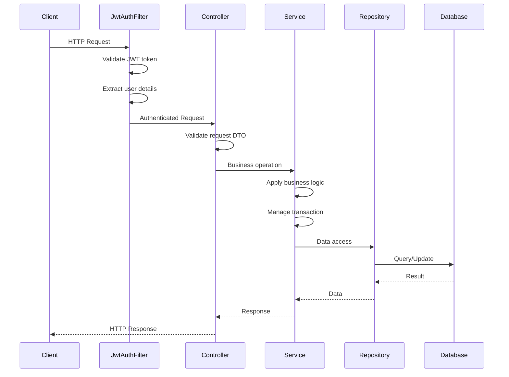
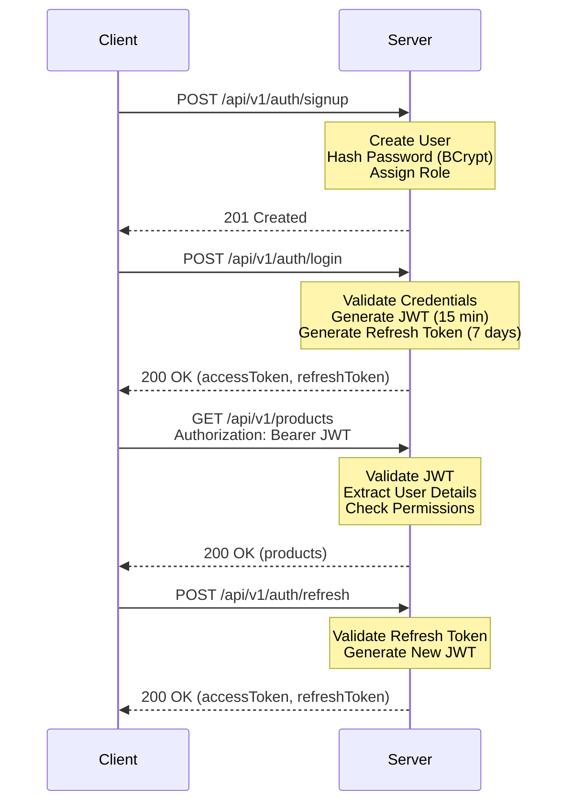

<div align="center">

<!-- LOGO -->


### Enterprise-Grade E-Commerce Backend

*Built with Spring Boot 3.5.7 | Oracle Database | Stripe Integration*

<br>

<!-- BADGES -->
[](https://github.com)
[](https://adoptium.net/)
[](https://spring.io/projects/spring-boot)
[](https://www.oracle.com/database/)
[](https://stripe.com/)
[](LICENSE)

</div>

---

## 📋 Table of Contents

- [Overview](#overview)
- [Current Status](#current-status)
- [Architecture](#architecture)
- [Technology Stack](#technology-stack)
- [Domain Model](#domain-model)
- [API Documentation](#api-documentation)
- [Payment Integration](#payment-integration)
- [Security](#security)
- [Quick Start](#quick-start)
- [Roadmap](#roadmap)
- [Contributing](#contributing)

---

## 🎯 Overview

Architected and developed **E-Commerce REST API**, an enterprise-grade e-commerce backend using **Spring Boot 3.5.7**, **Oracle Database**, and **Stripe Payment Integration**, serving as a scalable foundation for modern commerce platforms. Implemented **JWT-based authentication**, designed **8 JPA entities** with complex relationships, and built **34+ RESTful endpoints** across 7 controllers following clean architecture principles. Established comprehensive **error handling with 80+ domain-specific error codes**, optimized database performance with **25+ indexes** and strategic query optimization, and created a complete **order processing system** with payment integration using the Strategy Pattern. Demonstrated strong software engineering practices through **6 MapStruct mappers**, **transaction management**, **13 repositories with custom queries**, and **security-first design** with BCrypt hashing and JWT authentication.

### Key Capabilities
- **Robust Identity Management**: Secure JWT-based authentication, BCrypt password hashing, and role-based access control (RBAC).
- **Customer Management**: Complete CRUD operations with address management, email lookup, and pagination support.
- **Product Catalog**: Comprehensive product management with category filtering, search functionality, and stock tracking.
- **Order Processing**: Full order lifecycle management with status tracking, customer orders, and multi-item support.
- **Payment Integration**: Stripe PaymentIntent integration with Strategy Pattern for extensible payment methods.
- **Order Items Management**: Detailed order line items with quantity management and price tracking.
- **Centralized Error Handling**: 80+ entity-specific error codes with a global exception handler for consistent API error responses.

---

## 🚧 Current Status

> **📍 Development Phase: Core E-Commerce Features — Fully Implemented**

The project has a production-grade architectural foundation with comprehensive e-commerce features including authentication, user management, customer management, product catalog, order processing, and payment integration.

| Feature Area | Status | Description |
|--------------|--------|-------------|
| **Core Architecture** | ✅ Completed | Layered design (Controller → Service → Repository → DTO), Global Exception Handling (`@ControllerAdvice`), MapStruct integration with 6 mappers. |
| **Domain Modeling** | ✅ Completed | 8 Entities defined including `User`, `Customer`, `Product`, `Order`, `OrderItem`, `Payment`, `Address` (embedded), and enums for `Role`, `OrderStatus`, `PaymentMethod`, `PaymentStatus`. |
| **Authentication** | ✅ Completed | JWT-based Stateless Auth, `CustomUserDetailsService`, BCrypt hashing, `JwtAuthenticationFilter`, refresh token support. |
| **User API** | ✅ Completed | Registration, Login, Token Refresh, Get/Update/Delete User by ID. |
| **Customer API** | ✅ Completed | Create, Get (all/by ID/by email), Update customer with address management, pagination support. |
| **Product API** | ✅ Completed | CRUD operations, category filtering, search functionality, stock management, pagination. |
| **Order API** | ✅ Completed | Create order, Get orders (all/by ID/by customer/by status), Update order status, pagination. |
| **Order Item API** | ✅ Completed | Add/Update/Delete order items, Get items by order/product, quantity management. |
| **Payment API** | ✅ Completed | Stripe integration with PaymentIntent, create payment, get payment by ID/order, update payment status. |
| **Payment Strategy** | ✅ Completed | Strategy Pattern implementation with `PaymentStrategyFactory` for extensible payment methods. |
| **Repositories** | ✅ Completed | 13 Spring Data JPA repositories with custom queries for all entities. |
| **Mappers** | ✅ Completed | 6 MapStruct mappers for entity-DTO conversions (User, Customer, Product, Order, OrderItem, Payment). |
| **Error Codes** | ✅ Completed | 80+ entity-specific error codes across 6 domains (User, Customer, Product, Order, OrderItem, Payment). |
| **Validation** | ✅ Completed | Jakarta Validation with custom validators, centralized validation utility class. |
| **Database Optimization** | ✅ Completed | 25+ strategic indexes, JDBC batching (batch size 50), HikariCP connection pooling. |
| **API Documentation** | ✅ Completed | SpringDoc OpenAPI 3.0 with Swagger UI integration. |
| **Unit Testing** | ✅ Completed | Comprehensive unit tests for Order, Payment, and OrderItem services with JUnit 5 and Mockito. |
| **Shopping Cart** | 📅 Planned | Cart management with session support. |
| **Wishlist** | 📅 Planned | User wishlist functionality. |
| **Product Reviews** | 📅 Planned | Rating and review system. |
| **Discount System** | 📅 Planned | Coupon and discount management. |

---

## 🏗️ Architecture

### Project Structure

The codebase is organized into semantically meaningful packages to ensure separation of concerns:

```text
com.e_commerce.E_Commerce.REST.API
├── config             # Security (SecurityConfig), Stripe (StripeConfig)
├── controller         # REST API entry points
│   ├── AuthController          # /api/v1/auth   — Login, Registration & Token Refresh
│   ├── UserController          # /api/v1/users  — User CRUD
│   ├── CustomerController      # /api/v1/customers — Customer Management
│   ├── ProductController       # /api/v1/products — Product Catalog
│   ├── OrderController         # /api/v1/orders — Order Management
│   ├── OrderItemController     # /api/v1/order-items — Order Item Operations
│   └── PaymentController       # /api/v1/payments — Payment Processing
├── dto
│   ├── request        # 17 Request DTOs (Auth, User, Customer, Product, Order, Payment, etc.)
│   └── response       # 8 Response DTOs (User, Customer, Product, Order, OrderItem, Payment, Pagination)
├── exception          # Centralized Global Exception Handling (@ControllerAdvice)
│   ├── ErrorCode              # 80+ entity-specific error codes
│   ├── GlobalExceptionHandling # Unified error response formatting
│   ├── BusinessException      # Base business exception
│   ├── ResourceNotFoundException
│   ├── DuplicateResourceException
│   ├── ValidationException
│   └── domain-specific exceptions (customer, product, order, orderItem, payment)
├── filter             # JWT Authentication Filter
├── util               # Utilities
│   ├── JwtService             # Token generation, validation & claims extraction
│   └── ValidationUtility      # Centralized validation logic
├── mapper             # 6 MapStruct interfaces for Entity ↔ DTO conversion
│   ├── UserMapper, CustomerMapper, ProductMapper
│   ├── OrderMapper, OrderItemMapper, PaymentMapper
├── model              # JPA Entities (Rich Domain Model)
│   ├── User, Customer, Product, Order, OrderItem, Payment
│   ├── Address                # Embedded value object
│   └── enums          # Type-safe enumerations
│       ├── Role, OrderStatus, PaymentMethod, PaymentStatus
│       └── WhiteList (allowed sort fields)
├── repository         # 13 Spring Data JPA Interfaces with custom queries
│   ├── UserRepository, CustomerRepository, ProductRepository
│   ├── OrderRepository, OrderItemRepository, PaymentRepository
├── service            # Business Logic Layer
│   ├── AuthService            # Authentication business logic
│   ├── CustomUserDetailsService # Spring Security user details
│   ├── UserService            # User management service
│   ├── CustomerService        # Customer business rules
│   ├── ProductService         # Product management & validation
│   ├── OrderService           # Order processing orchestration
│   ├── OrderItemService       # Order item management
│   ├── OrderItemValidator     # Order validation logic
│   └── PaymentService         # Payment processing orchestration
└── payment            # Payment Strategy Pattern
    ├── PaymentStrategy        # Strategy interface
    ├── PaymentStrategyFactory # Factory for strategy selection
    ├── StripePaymentStrategy  # Stripe implementation
    ├── PaymentMethod          # Enum (STRIPE, PAYPAL, etc.)
    └── PaymentStatus          # Enum (PENDING, COMPLETED, FAILED, etc.)
```

### Domain Model Highlight

The application uses a sophisticated entity relationship model:
* **User & Customer**: Split responsibilities — `User` handles Authentication (email, password, roles), `Customer` manages Profile Data (name, email, phone, address).
* **Product**: Product catalog with stock management, pricing, categories, and active status.
* **Order & OrderItem**: Order aggregate root with one-to-many order items, status tracking, and total amount calculation.
* **Payment**: Payment entity with Stripe integration, transaction tracking, and payment status lifecycle.
* **Address**: Embedded value object for customer addresses.
* **Enums**: Type-safe enumerations for `Role`, `OrderStatus`, `PaymentMethod`, `PaymentStatus`.

---

## 🛠️ Technology Stack

<div align="center">

### Core Backend


### Database & Caching


### Payment Integration


### Utilities & Tools


### Testing


</div>

---

## 🚀 API Documentation

### Authentication (`/api/v1/auth`)
| Method | Endpoint | Description | Status |
|--------|----------|-------------|--------|
| `POST` | `/register` | Register a new user with email/password | ✅ |
| `POST` | `/login` | Authenticate and retrieve JWT Access Token | ✅ |
| `POST` | `/refresh` | Refresh access token using refresh token | ✅ |

### User Management (`/api/v1/users`)
| Method | Endpoint | Description | Status |
|--------|----------|-------------|--------|
| `GET` | `/` | Get all users | ✅ |
| `GET` | `/{id}` | Get user details by ID | ✅ |
| `PUT` | `/{id}` | Update user information | ✅ |
| `DELETE`| `/{id}` | Delete a user | ✅ |

### Customer Management (`/api/v1/customers`)
| Method | Endpoint | Description | Status |
|--------|----------|-------------|--------|
| `POST` | `/` | Create a new customer | ✅ |
| `GET` | `/` | Get all customers (paginated) | ✅ |
| `GET` | `/{id}` | Get customer by ID | ✅ |
| `GET` | `/email/{email}` | Get customer by email | ✅ |
| `PUT` | `/{id}` | Update customer information | ✅ |

### Product Catalog (`/api/v1/products`)
| Method | Endpoint | Description | Status |
|--------|----------|-------------|--------|
| `POST` | `/` | Add a new product | ✅ |
| `GET` | `/` | Get all products (paginated) | ✅ |
| `GET` | `/{id}` | Get product by ID | ✅ |
| `GET` | `/category/{category}` | Get products by category (paginated) | ✅ |
| `GET` | `/search` | Search products by name | ✅ |
| `PUT` | `/{id}` | Update product information | ✅ |
| `DELETE`| `/{id}` | Delete a product | ✅ |

### Order Management (`/api/v1/orders`)
| Method | Endpoint | Description | Status |
|--------|----------|-------------|--------|
| `POST` | `/` | Create a new order | ✅ |
| `GET` | `/` | Get all orders (paginated) | ✅ |
| `GET` | `/{id}` | Get order by ID | ✅ |
| `GET` | `/customer/{customerId}` | Get orders by customer | ✅ |
| `GET` | `/status/{status}` | Get orders by status (paginated) | ✅ |
| `PUT` | `/{id}/status` | Update order status | ✅ |

### Order Items (`/api/v1/order-items`)
| Method | Endpoint | Description | Status |
|--------|----------|-------------|--------|
| `POST` | `/{orderId}` | Add item to order | ✅ |
| `GET` | `/{orderId}/{itemId}` | Get order item by ID | ✅ |
| `GET` | `/order/{orderId}` | Get all items for an order | ✅ |
| `GET` | `/order/{orderId}/product/{productId}` | Get items by order and product | ✅ |
| `GET` | `/product/{productId}` | Get all items for a product | ✅ |
| `PUT` | `/{orderId}/{itemId}` | Update order item quantity | ✅ |
| `DELETE`| `/{orderId}/{itemId}` | Remove order item | ✅ |

### Payment Processing (`/api/v1/payments`)
| Method | Endpoint | Description | Status |
|--------|----------|-------------|--------|
| `POST` | `/` | Create payment (returns Stripe clientSecret) | ✅ |
| `GET` | `/{id}` | Get payment by ID | ✅ |

> **Note**: Full interactive API documentation available via **Swagger UI** at `/swagger-ui.html` when running the application.

---

## 💳 Payment Integration

### Stripe PaymentIntent Flow

The application uses Stripe's PaymentIntent API for secure payment processing:

1. **Client creates order** → Order is created with `PENDING` status
2. **Client initiates payment** → POST `/api/v1/payments` with order ID and amount
3. **Server creates PaymentIntent** → Stripe generates `clientSecret`
4. **Server returns clientSecret** → Client receives payment response with `clientSecret`
5. **Client confirms payment** → Using Stripe.js/Elements with `clientSecret`
6. **Stripe processes payment** → Payment status updated to `COMPLETED` or `FAILED`

### Payment Strategy Pattern

The application implements the Strategy Pattern for extensible payment methods:

```java
PaymentStrategyFactory → Selects appropriate strategy
    ├── StripePaymentStrategy (implemented)
    ├── PayPalPaymentStrategy (future)
    └── ApplePayPaymentStrategy (future)
```

---

## 🔐 Security

### Request Flow



### Security Diagram



### Security Features

The application implements a robust, multi-layered security architecture:

- **Stateless JWT Authentication**: Every request is authenticated via a JWT token in the `Authorization` header.
- **BCrypt Password Hashing**: User passwords are never stored in plain text.
- **Spring Security Filter Chain**: Custom `JwtAuthenticationFilter` intercepts requests before reaching controllers.
- **Custom `UserDetailsService`**: Loads user data from the database for authentication validation.
- **Role-Based Access Control**: ADMIN and USER roles with granular permissions.
- **Bean Validation**: All incoming DTOs use Jakarta Validation annotations (`@Valid`, `@NotBlank`, `@Positive`, etc.).
- **Centralized Validation**: `ValidationUtility` class for reusable validation logic.
- **CORS & CSRF Configuration**: Managed through `SecurityConfig`.

---

## 🚀 Quick Start

### Prerequisites

```
☕ Java 17 (LTS)     🗄️ Oracle Database 19c+     📦 Maven 3.6+     💻 IDE (IntelliJ IDEA / Eclipse)
```

### Installation Steps

**1. Clone Repository**
```bash
git clone <repository-url>
cd E-Commerce-REST-API
```

**2. Configure Database**

Create an Oracle database and update `src/main/resources/application.yaml`:

```yaml
spring:
  datasource:
    url: jdbc:oracle:thin:@//localhost:1521/orclpdb
    username: ${DB_USERNAME:your_username}
    password: ${DB_PASSWORD:your_password}
    driver-class-name: oracle.jdbc.OracleDriver
  
  jpa:
    hibernate:
      ddl-auto: update  # Use 'validate' in production
    show-sql: false
    properties:
      hibernate:
        dialect: org.hibernate.dialect.OracleDialect
        jdbc:
          batch_size: 50
        order_inserts: true
        order_updates: true

server:
  port: 8080

jwt:
  secret: ${JWT_SECRET:your-secret-key-min-256-bits}
  expiration: 900000  # 15 minutes
  refresh-expiration: 604800000  # 7 days

stripe:
  api:
    key: ${STRIPE_API_KEY:sk_test_your_stripe_key}
```

### Quick Test

**Register a new user**:
```bash
curl -X POST http://localhost:8080/api/v1/auth/signup \
  -H "Content-Type: application/json" \
  -d '{
    "email": "admin@example.com",
    "password": "SecurePass123",
    "firstName": "Admin",
    "lastName": "User"
  }'
```

**Login**:
```bash
curl -X POST http://localhost:8080/api/v1/auth/login \
  -H "Content-Type: application/json" \
  -d '{
    "email": "admin@example.com",
    "password": "SecurePass123"
  }'
```

---

## 📋 Roadmap

| Phase | Feature | Priority |
|-------|---------|----------|
| 🟢 Phase 1 | Core Architecture, Auth, User API, Customer API | ✅ Done |
| 🟢 Phase 2 | Product Catalog (CRUD, Search, Categories) | ✅ Done |
| 🟢 Phase 3 | Order Processing (Create, Status, Customer Orders) | ✅ Done |
| 🟢 Phase 4 | Order Items Management (Add, Update, Delete) | ✅ Done |
| 🟢 Phase 5 | Payment Integration (Stripe PaymentIntent) | ✅ Done |
| 🟢 Phase 6 | Unit Testing (Order, Payment, OrderItem Services) | ✅ Done |
| 🟡 Phase 7 | Shopping Cart System | 🔜 Next |
| 🟡 Phase 8 | Wishlist Feature | 🔜 Next |
| 🟡 Phase 9 | Product Reviews & Ratings | Planned |
| 🟠 Phase 10 | Discount & Coupon System | Future |
| 🟠 Phase 11 | Email Notification Service | Future |
| 🟠 Phase 12 | Real-time Order Tracking (WebSocket) | Future |

---

## 🔐 Database Schema

For detailed database schema and indexing strategy, see:
- **[DB_SCHEMA&FLOW.md](DB_SCHEMA&FLOW.md)** - Complete database schema and relationships
- **[DATABASE_INDEXING_STRATEGY.md](DATABASE_INDEXING_STRATEGY.md)** - Comprehensive indexing strategy with 25+ indexes
- **[DB Diagram.png](DB%20Diagram.png)** - Visual database diagram

---

## ▎LLMs I Worked With

<div align="center">

| AI Assistant | Provider | Role |
|:-------------|:---------|:-----|
| 🤖 **Claude** | Anthropic | Architecture guidance, documentation, code review |
| ✨ **Gemini** | Google DeepMind | Code generation, debugging, implementation |

</div>

---

## 🤝 Contributing

Contributions are welcome!
1. Fork the repository
2. Create your feature branch (`git checkout -b feature/AmazingFeature`)
3. Commit your changes (`git commit -m 'Add some AmazingFeature'`)
4. Push to the branch (`git push origin feature/AmazingFeature`)
5. Open a Pull Request

---

## 📞 Contact

**Alaa Mohamed** - [333alaamo@gmail.com](mailto:333alaamo@gmail.com)

Project Link: [https://github.com/alaa-333/E-Commerce-REST-API](https://github.com/alaa-333/E-Commerce-REST-API)

---

<div align="center">

Made with ❤️ by Alaa Mohamed

</div>
