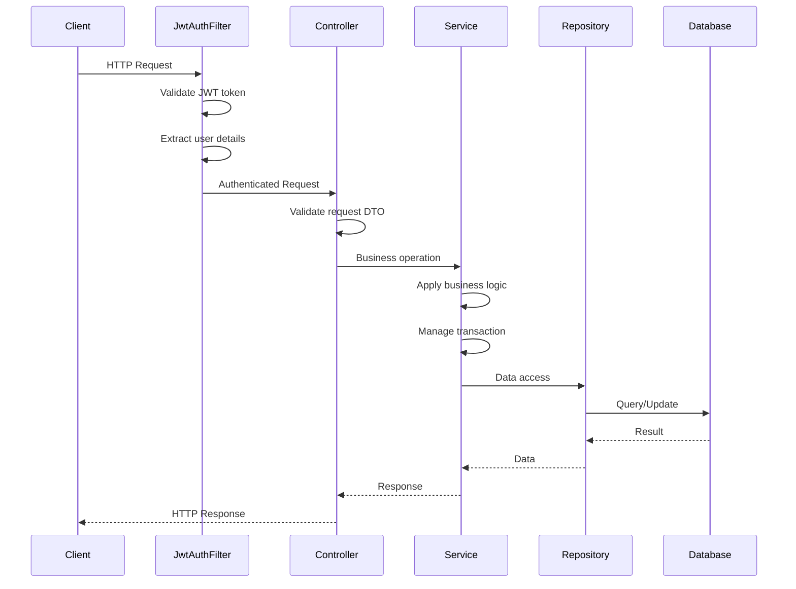
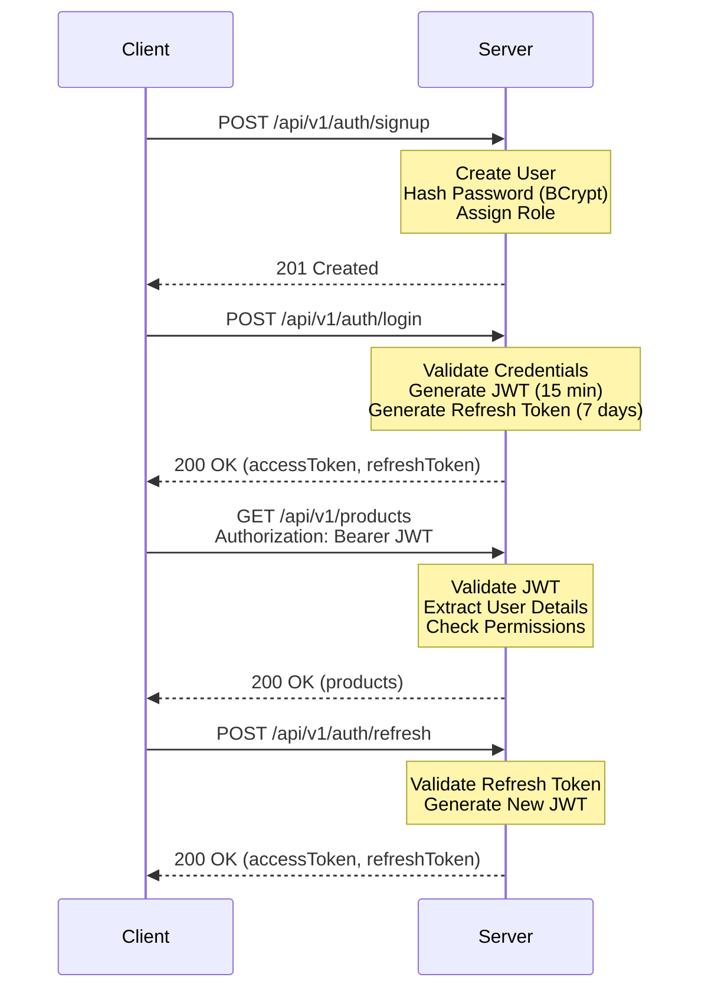

<div align="center">

<picture>
  <source media="(max-width: 480px)" srcset="https://img.icons8.com/fluency/64/shopping-cart.png">
  
</picture>

<br/>

# E-Commerce REST API

### Enterprise-Grade Backend for Modern Commerce Platforms

<br/>

<div style="display: flex; flex-wrap: wrap; justify-content: center; gap: 8px;">

[](/)
[](https://openjdk.org/)
[](https://spring.io/projects/spring-boot)
[](https://www.oracle.com/database/)
[](https://stripe.com/)
[](/)

</div>

<br/>

<details>
<summary>📑 <b>Table of Contents</b></summary>

- [Overview](#-overview)
- [Key Features](#-key-features)
- [Technology Stack](#-technology-stack)
- [Architecture](#-architecture)
- [Security](#-security)
- [Database Schema](#-database-schema)
- [Quick Start](#-quick-start)
- [API Documentation](#-api-documentation)
- [Payment Integration](#-payment-integration)
- [Configuration](#-configuration)
- [Testing](#-testing)
- [Deployment](#-deployment)
- [Roadmap](#-roadmap)
- [Contributing](#-contributing)
- [License](#-license)

</details>

<br/>

━━━━━━━━━━━━━━━━━━━━━━━━━━━━━━━━━━━━━

<div>

*A production-ready RESTful API delivering comprehensive e-commerce functionality with secure authentication, <br/> customer management, product catalog, order processing, and integrated payment solutions.*

</div>

━━━━━━━━━━━━━━━━━━━━━━━━━━━━━━━━━━━━━

</div>

<br/>

---

## ▎Overview

This REST API serves as a comprehensive backend solution for e-commerce applications, implementing industry-standard patterns and best practices for scalability, maintainability, and security. Built with Spring Boot 3.5.7 and Java 17, it provides a robust foundation for modern commerce platforms with enterprise-grade security, payment processing, and data management capabilities.

<br/>

---

## ▎Key Features

<br/>

### 🔐 Security & Authentication

<div align="center">

| Feature | Implementation | Status |
|:--------|:--------------|:------:|
| **JWT Authentication** | Stateless token-based auth with refresh tokens | ✓ |
| **Role-Based Access Control** | ADMIN and USER roles with granular permissions | ✓ |
| **Password Encryption** | BCrypt hashing for secure credential storage | ✓ |
| **Session Management** | Stateless architecture with JWT | ✓ |
| **Security Filter Chain** | Custom JWT authentication filter | ✓ |

</div>

<br/>

### 💼 Business Capabilities

<div align="center">

| Feature | Description | Status |
|:--------|:------------|:------:|
| 👤 **User Management** | Registration, login, and user profile management | ✓ |
| 🛒 **Customer Management** | Complete CRUD with address management & search | ✓ |
| 📦 **Product Catalog** | Inventory management with stock tracking & categories | ✓ |
| 🛍️ **Order Processing** | End-to-end order lifecycle with status tracking | ✓ |
| 📋 **Order Items** | Multi-item orders with quantity and pricing | ✓ |
| 💳 **Payment Integration** | Stripe PaymentIntent with strategy pattern | ✓ |
| 📊 **Pagination & Sorting** | Dynamic pagination with customizable sorting | ✓ |
| 🔍 **Search & Filtering** | Advanced product and customer search | ✓ |

</div>

<br/>

### 🏗️ Technical Excellence

<div align="center">

| Feature | Implementation | Status |
|:--------|:--------------|:------:|
| **Strategy Pattern** | Extensible payment method architecture | ✓ |
| **DTO Pattern** | Clean API contracts with MapStruct | ✓ |
| **Global Exception Handling** | Centralized error management | ✓ |
| **Input Validation** | Jakarta Validation with custom validators | ✓ |
| **Database Optimization** | JDBC batching and query optimization | ✓ |
| **API Documentation** | SpringDoc OpenAPI 3.0 integration | ✓ |
| **Logging** | SLF4J with structured logging | ✓ |

</div>

<br/>

---

## ▎Technology Stack

<br/>

### Core Framework & Libraries

| Component | Version | Purpose |
|:----------|:-------:|:--------|
| **Spring Boot** | 3.5.7 | Application framework & dependency injection |
| **Spring Security** | 6.x | Authentication & authorization |
| **Spring Data JPA** | 3.x | Data persistence & repository abstraction |
| **Hibernate ORM** | 6.x | Object-relational mapping |
| **Jakarta Validation** | 3.x | Bean validation & input constraints |
| **SpringDoc OpenAPI** | 2.8.15 | API documentation & Swagger UI |

<br/>

### Security & Authentication

| Component | Version | Purpose |
|:----------|:-------:|:--------|
| **JJWT** | 0.13.0 | JWT token generation & validation |
| **BCrypt** | — | Password hashing algorithm |
| **Spring Security** | 6.x | Security filter chain & RBAC |

<br/>

### Payment & Integration

| Component | Version | Purpose |
|:----------|:-------:|:--------|
| **Stripe Java SDK** | 30.0.0 | Payment processing integration |
| **MapStruct** | 1.5.3 | Type-safe object mapping |

<br/>

### Infrastructure & Database

| Component | Version | Purpose |
|:----------|:-------:|:--------|
| **Java** | 17 (LTS) | Runtime environment |
| **Maven** | 3.6+ | Build automation & dependency management |
| **Oracle Database** | 19c+ | Enterprise data storage |
| **HikariCP** | — | High-performance connection pooling |

<br/>

### Development Tools

| Library | Purpose |
|:--------|:--------|
| **Lombok** | Reduces boilerplate with annotations (@Data, @Builder, etc.) |
| **Spring Boot DevTools** | Hot reload & development utilities |
| **Spring Boot Actuator** | Production-ready monitoring endpoints |

<br/>

---

## ▎Architecture

<br/>

### Design Patterns & Principles

This application follows enterprise architecture patterns and SOLID principles:

- **Layered Architecture**: Clear separation between presentation, business, and data layers
- **Strategy Pattern**: Extensible payment processing system
- **Factory Pattern**: Dynamic payment strategy selection
- **Repository Pattern**: Data access abstraction
- **DTO Pattern**: Clean API contracts with entity-DTO separation
- **Dependency Injection**: Spring IoC container for loose coupling
- **RESTful Design**: Resource-based API with proper HTTP semantics

<br/>

### Project Structure

<br/>

```
E-Commerce-REST-API/
│
├── src/main/java/com/e_commerce/E_Commerce/REST/API/
│   │
│   ├── 📂 config/                  # Configuration Layer
│   │   ├── SecurityConfig.java          # Security filter chain & RBAC
│   │   └── StripeConfig.java            # Stripe API initialization
│   │
│   ├── 📂 controller/              # REST API Endpoints (Presentation Layer)
│   │   ├── AuthController.java          # Authentication (login/signup/refresh)
│   │   ├── UserController.java          # User management endpoints
│   │   ├── CustomerController.java      # Customer CRUD operations
│   │   ├── ProductController.java       # Product catalog & search
│   │   ├── OrderController.java         # Order management & status updates
│   │   ├── OrderItemController.java     # Order item operations
│   │   └── PaymentController.java       # Payment processing endpoints
│   │
│   ├── 📂 filter/                  # Security Filters
│   │   └── JwtAuthFilter.java           # JWT token validation filter
│   │
│   ├── 📂 service/                 # Business Logic Layer
│   │   ├── AuthService.java             # Authentication business logic
│   │   ├── CustomUserDetailsService.java # Spring Security user details
│   │   ├── UserService.java             # User management service
│   │   ├── CustomerService.java         # Customer business rules
│   │   ├── ProductService.java          # Product management & validation
│   │   ├── OrderService.java            # Order processing orchestration
│   │   ├── OrderItemService.java        # Order item management
│   │   ├── OrderItemValidator.java      # Order validation logic
│   │   └── PaymentService.java          # Payment processing orchestration
│   │
│   ├── 📂 repository/              # Data Access Layer (Spring Data JPA)
│   │   ├── UserRepository.java          # User data access
│   │   ├── CustomerRepository.java      # Customer queries
│   │   ├── ProductRepository.java       # Product queries & search
│   │   ├── OrderRepository.java         # Order data access
│   │   ├── OrderItemRepository.java     # Order item queries
│   │   └── PaymentRepository.java       # Payment data access
│   │
│   ├── 📂 model/                   # Domain Entities (JPA)
│   │   ├── User.java                    # User entity with roles
│   │   ├── Customer.java                # Customer entity with embedded address
│   │   ├── Product.java                 # Product catalog entity
│   │   ├── Order.java                   # Order aggregate root
│   │   ├── OrderItem.java               # Order line items
│   │   ├── Payment.java                 # Payment transaction entity
│   │   ├── Address.java                 # Embedded address value object
│   │   └── enums/
│   │       ├── Role.java                 # User roles (ROLE_ADMIN, ROLE_USER)
│   │       ├── OrderStatus.java          # Order lifecycle states
│   │       └── WhiteList.java            # Allowed sort fields
│   │
│   ├── 📂 dto/                      # Data Transfer Objects
│   │   ├── request/                     # Input DTOs (API contracts)
│   │   │   ├── LoginRequestDto.java
│   │   │   ├── SignupRequestDto.java
│   │   │   ├── RefreshTokenRequest.java
│   │   │   ├── UserCreateRequestDto.java
│   │   │   ├── UserUpdateRequestDto.java
│   │   │   ├── CustomerCreateRequestDTO.java
│   │   │   ├── CustomerUpdateReqDTO.java
│   │   │   ├── ProductCreateRequestDTO.java
│   │   │   ├── ProductUpdateRequestDTO.java
│   │   │   ├── OrderCreateRequestDTO.java
│   │   │   ├── OrderUpdateRequestDTO.java
│   │   │   ├── OrderItemCreateRequestDTO.java
│   │   │   ├── OrderItemUpdateRequestDTO.java
│   │   │   ├── PaymentRequestDTO.java
│   │   │   ├── PaymentUpdateRequestDTO.java
│   │   │   ├── AddressRequestDTO.java
│   │   │   └── PaginationRequestDto.java
│   │   │
│   │   └── response/                    # Output DTOs (API responses)
│   │       ├── UserResponse.java
│   │       ├── CustomerResponseDTO.java
│   │       ├── ProductResponseDTO.java
│   │       ├── OrderResponseDTO.java
│   │       ├── OrderItemResponseDTO.java
│   │       ├── PaymentResponseDTO.java
│   │       ├── AddressResponseDTO.java
│   │       └── PaginationResponseDto.java
│   │
│   ├── 📂 mapper/                   # Entity-DTO Mapping (MapStruct)
│   │   ├── UserMapper.java              # User entity ↔ DTO
│   │   ├── CustomerMapper.java          # Customer entity ↔ DTO
│   │   ├── ProductMapper.java           # Product entity ↔ DTO
│   │   ├── OrderMapper.java             # Order entity ↔ DTO
│   │   ├── OrderItemMapper.java         # OrderItem entity ↔ DTO
│   │   └── PaymentMapper.java           # Payment entity ↔ DTO
│   │
│   ├── 📂 exception/                # Exception Handling
│   │   ├── GlobalExceptionHandling.java     # @ControllerAdvice handler
│   │   ├── BusinessException.java           # Base business exception
│   │   ├── ResourceNotFoundException.java   # 404 errors
│   │   ├── DuplicateResourceException.java  # Duplicate resource errors
│   │   ├── ValidationException.java         # Validation errors
│   │   ├── ErrorCode.java                   # Standardized error codes
│   │   ├── ErrorResponse.java               # Error response structure
│   │   │
│   │   ├── customer/                        # Domain-specific exceptions
│   │   │   ├── CustomerNotFoundException.java
│   │   │   └── CustomerInactiveException.java
│   │   ├── product/
│   │   │   ├── ProductNotFoundException.java
│   │   │   ├── ProductOutOfStockException.java
│   │   │   ├── InsufficientStockException.java
│   │   │   └── ProductQuantityExceedException.java
│   │   ├── order/
│   │   │   ├── OrderNotFoundException.java
│   │   │   ├── OrderAlreadyProcessedException.java
│   │   │   └── OrderTotalInvalidException.java
│   │   ├── orderItem/
│   │   │   └── OrderItemsEmptyException.java
│   │   └── payment/
│   │       └── PaymentAmountMismatchException.java
│   │
│   ├── 📂 payment/                   # Payment Strategy Pattern
│   │   ├── PaymentStrategy.java            # Strategy interface
│   │   ├── PaymentStrategyFactory.java     # Factory for strategy selection
│   │   ├── StripePaymentStrategy.java      # Stripe implementation
│   │   ├── PaymentMethod.java              # Enum (STRIPE, PAYPAL, etc.)
│   │   └── PaymentStatus.java              # Enum (PENDING, CONFIRMED, etc.)
│   │
│   ├── 📂 util/                      # Utilities
│   │   ├── JwtService.java              # JWT generation & validation
│   │   └── JwtResponse.java             # JWT response wrapper
│   │
│   └── ECommerceRestApiApplication.java    # Spring Boot main class
│
├── src/main/resources/
│   ├── application.yaml                     # Application configuration
│   ├── static/                              # Static resources
│   └── templates/                           # Template files
│
├── src/test/java/                           # Test sources
│
├── pom.xml                                  # Maven dependencies
├── DB Diagram.png                           # Database schema diagram
├── DB_SCHEMA&FLOW.md                        # Database documentation
├── Stripe Payment Work Flow Guide.md        # Payment integration guide
└── README.md                                # Project documentation
```

<br/>

### Request Flow




<br/>

---

## ▎Security



<br/>

### Security Configuration

**JWT Token Structure**:
```json
{
  "sub": "user@example.com",
  "roles": ["ROLE_USER"],
  "iat": 1706400000,
  "exp": 1706400900
}
```

**Token Expiration**:
- Access Token: 15 minutes
- Refresh Token: 7 days

**Password Security**:
- BCrypt hashing with salt
- Minimum 8 characters (configurable)
- Stored securely in database

<br/>

### Authorization Matrix

| Endpoint | ROLE_USER | ROLE_ADMIN | Public |
|:---------|:---------:|:----------:|:------:|
| `POST /api/v1/auth/signup` | — | — | ✓ |
| `POST /api/v1/auth/login` | — | — | ✓ |
| `POST /api/v1/auth/refresh` | — | — | ✓ |
| `GET /api/v1/products/**` | — | — | ✓ |
| `POST /api/v1/products/**` | ✗ | ✓ | ✗ |
| `PUT /api/v1/products/**` | ✗ | ✓ | ✗ |
| `DELETE /api/v1/products/**` | ✗ | ✓ | ✗ |
| `GET /api/v1/customers/**` | ✗ | ✓ | ✗ |
| `POST /api/v1/customers/**` | ✗ | ✓ | ✗ |
| `PUT /api/v1/customers/**` | ✗ | ✓ | ✗ |
| `GET /api/v1/orders/**` | ✓ | ✓ | ✗ |
| `POST /api/v1/orders/**` | ✓ | ✓ | ✗ |
| `GET /api/v1/payments/**` | ✓ | ✓ | ✗ |
| `POST /api/v1/payments/**` | ✓ | ✓ | ✗ |

<br/>

---

<br/>

### Database Optimizations

- **JDBC Batching**: Batch size of 50 for bulk operations
- **Order Inserts/Updates**: Hibernate groups operations by entity type
- **Connection Pooling**: HikariCP for high-performance connections
- **Strategic Indexing**: Comprehensive index strategy on foreign keys, search fields, and frequently queried columns
- **Lazy Loading**: Optimized entity relationships
- **Query Optimization**: Efficient JOIN operations and fetch strategies

> **📊 For detailed indexing strategy, see [DATABASE_INDEXING_STRATEGY.md](DATABASE_INDEXING_STRATEGY.md)**

<br/>

---

## ▎Quick Start

<br/>

### Prerequisites

Ensure you have the following installed:

```
☕ Java 17 (LTS)     🗄️ Oracle Database 19c+     📦 Maven 3.6+     💻 IDE (IntelliJ IDEA / Eclipse)
```

<br/>

### Installation Steps

**1. Clone Repository**
```bash
git clone <repository-url>
cd E-Commerce-REST-API
```

<br/>

**2. Configure Database**

Create an Oracle database and update `src/main/resources/application.yaml`:

```yaml
spring:
  datasource:
    url: jdbc:oracle:thin:@//localhost:1521/orclpdb
    username: ${DB_USERNAME:your_username}
    password: ${DB_PASSWORD:your_password}
    driver-class-name: oracle.jdbc.OracleDriver
  
  jpa:
    hibernate:
      ddl-auto: update  # Use 'validate' in production
    show-sql: false
    properties:
      hibernate:
        dialect: org.hibernate.dialect.OracleDialect
        jdbc:
          batch_size: 50
        order_inserts: true
        order_updates: true

server:
  port: 8080

jwt:
  secret: ${JWT_SECRET:your-secret-key-min-256-bits}
  expiration: 900000  # 15 minutes
  refresh-expiration: 604800000  # 7 days

stripe:
  api:
    key: ${STRIPE_API_KEY:sk_test_your_stripe_key}
```

<br/>

**4. Build Project**
```bash
mvn clean install
```

<br/>

**5. Run Application**
```bash
mvn spring-boot:run
```

API available at: `http://localhost:8080/api/v1`

<br/>

**6. Access API Documentation**

Once the application is running, access the interactive API documentation:

```
Swagger UI: http://localhost:8080/swagger-ui.html
```

<br/>

### Quick Test

**Register a new user**:
```bash
curl -X POST http://localhost:8080/api/v1/auth/signup \
  -H "Content-Type: application/json" \
  -d '{
    "email": "admin@example.com",
    "password": "SecurePass123",
    "firstName": "Admin",
    "lastName": "User"
  }'
```

**Login**:
```bash
curl -X POST http://localhost:8080/api/v1/auth/login \
  -H "Content-Type: application/json" \
  -d '{
    "email": "admin@example.com",
    "password": "SecurePass123"
  }'
```

<br/>


---


<br/>

### Authentication Endpoints

| Method | Endpoint | Description | Auth Required |
|:------:|:---------|:------------|:-------------:|
| `POST` | `/api/v1/auth/signup` | Register new user | ✗ |
| `POST` | `/api/v1/auth/login` | Authenticate user | ✗ |
| `POST` | `/api/v1/auth/refresh` | Refresh access token | ✗ |

<br/>

### User Endpoints

| Method | Endpoint | Description | Auth Required |
|:------:|:---------|:------------|:-------------:|
| `GET` | `/api/v1/users` | Retrieve all users | ✓ (ADMIN) |
| `GET` | `/api/v1/users/{id}` | Retrieve user by ID | ✓ (ADMIN) |
| `PUT` | `/api/v1/users/{id}` | Update user information | ✓ (ADMIN) |
| `DELETE` | `/api/v1/users/{id}` | Delete user | ✓ (ADMIN) |

<br/>

### Customer Endpoints

| Method | Endpoint | Description | Auth Required |
|:------:|:---------|:------------|:-------------:|
| `POST` | `/api/v1/customers` | Register new customer | ✓ (ADMIN) |
| `GET` | `/api/v1/customers` | Retrieve all customers (paginated) | ✓ (ADMIN) |
| `GET` | `/api/v1/customers/{id}` | Retrieve customer by ID | ✓ (ADMIN) |
| `GET` | `/api/v1/customers/email/{email}` | Retrieve customer by email | ✓ (ADMIN) |
| `PUT` | `/api/v1/customers/{id}` | Update customer information | ✓ (ADMIN) |

<br/>

### Product Endpoints

| Method | Endpoint | Description | Auth Required |
|:------:|:---------|:------------|:-------------:|
| `POST` | `/api/v1/products` | Add new product | ✓ (ADMIN) |
| `GET` | `/api/v1/products` | Retrieve all products (paginated) | ✗ |
| `GET` | `/api/v1/products/{id}` | Retrieve product by ID | ✗ |
| `GET` | `/api/v1/products/category/{category}` | Retrieve products by category | ✗ |
| `GET` | `/api/v1/products/search` | Search products | ✗ |
| `PUT` | `/api/v1/products/{id}` | Update product information | ✓ (ADMIN) |
| `DELETE` | `/api/v1/products/{id}` | Delete product | ✓ (ADMIN) |

<br/>

### Order Endpoints

| Method | Endpoint | Description | Auth Required |
|:------:|:---------|:------------|:-------------:|
| `POST` | `/api/v1/orders` | Create new order | ✓ (USER/ADMIN) |
| `GET` | `/api/v1/orders` | Retrieve all orders (paginated) | ✓ (ADMIN) |
| `GET` | `/api/v1/orders/{id}` | Retrieve order by ID | ✓ (USER/ADMIN) |
| `GET` | `/api/v1/orders/customer/{customerId}` | Retrieve orders by customer | ✓ (USER/ADMIN) |
| `GET` | `/api/v1/orders/status/{status}` | Retrieve orders by status | ✓ (ADMIN) |
| `PATCH` | `/api/v1/orders/{id}/status` | Update order status | ✓ (ADMIN) |
| `PUT` | `/api/v1/orders/{id}` | Update order | ✓ (USER/ADMIN) |

<br/>

### Order Item Endpoints

| Method | Endpoint | Description | Auth Required |
|:------:|:---------|:------------|:-------------:|
| `POST` | `/api/v1/order-items` | Add item to order | ✓ (USER/ADMIN) |
| `GET` | `/api/v1/order-items/order/{orderId}` | Get items for order | ✓ (USER/ADMIN) |
| `PUT` | `/api/v1/order-items/{id}` | Update order item | ✓ (USER/ADMIN) |
| `DELETE` | `/api/v1/order-items/{id}` | Remove order item | ✓ (USER/ADMIN) |

<br/>

### Payment Endpoints

| Method | Endpoint | Description | Auth Required |
|:------:|:---------|:------------|:-------------:|
| `POST` | `/api/v1/payments` | Create payment (returns Stripe clientSecret) | ✓ (USER/ADMIN) |
| `GET` | `/api/v1/payments/{id}` | Retrieve payment by ID | ✓ (USER/ADMIN) |
| `GET` | `/api/v1/payments/order/{orderId}` | Retrieve payment by order | ✓ (USER/ADMIN) |
| `PUT` | `/api/v1/payments/{id}` | Update payment status | ✓ (ADMIN) |

<br/>

<details>
<summary><b>📄 Request & Response Examples</b></summary>

<br/>

### Authentication

**Signup Request**
```http
POST /api/v1/auth/signup HTTP/1.1
Content-Type: application/json

{
  "email": "user@example.com",
  "password": "SecurePass123",
  "firstName": "John",
  "lastName": "Doe"
}
```

**Signup Response**
```json
{
  "message": "User registered successfully",
  "userId": 1
}
```

<br/>

**Login Request**
```http
POST /api/v1/auth/login HTTP/1.1
Content-Type: application/json

{
  "email": "user@example.com",
  "password": "SecurePass123"
}
```

**Login Response**
```json
{
  "accessToken": "eyJhbGciOiJIUzI1NiIsInR5cCI6IkpXVCJ9...",
  "refreshToken": "eyJhbGciOiJIUzI1NiIsInR5cCI6IkpXVCJ9...",
  "tokenType": "Bearer",
  "expiresIn": 900000
}
```

<br/>

### Customer Management

**Create Customer Request**
```http
POST /api/v1/customers HTTP/1.1
Content-Type: application/json
Authorization: Bearer <JWT_TOKEN>

{
  "userId": 1,
  "firstName": "John",
  "lastName": "Doe",
  "email": "john.doe@example.com",
  "phone": "+1234567890",
  "address": {
    "street": "123 Main Street",
    "city": "New York",
    "state": "NY",
    "zipCode": "10001",
    "country": "USA"
  }
}
```

**Customer Response**
```json
{
  "id": 1,
  "userId": 1,
  "firstName": "John",
  "lastName": "Doe",
  "email": "john.doe@example.com",
  "phone": "+1234567890",
  "address": {
    "street": "123 Main Street",
    "city": "New York",
    "state": "NY",
    "zipCode": "10001",
    "country": "USA"
  },
  "createdAt": "2026-01-28T10:30:00"
}
```

<br/>

### Product Management

**Create Product Request**
```http
POST /api/v1/products HTTP/1.1
Content-Type: application/json
Authorization: Bearer <JWT_TOKEN>

{
  "name": "Wireless Headphones",
  "description": "Premium noise-cancelling wireless headphones",
  "price": 299.99,
  "stockQuantity": 50,
  "category": "Electronics",
  "imgUrl": "https://example.com/images/headphones.jpg",
  "active": true
}
```

**Product Response**
```json
{
  "id": 1,
  "name": "Wireless Headphones",
  "description": "Premium noise-cancelling wireless headphones",
  "price": 299.99,
  "stockQuantity": 50,
  "category": "Electronics",
  "imgUrl": "https://example.com/images/headphones.jpg",
  "active": true,
  "createdAt": "2026-01-28T10:30:00"
}
```

<br/>

### Order Management

**Create Order Request**
```http
POST /api/v1/orders HTTP/1.1
Content-Type: application/json
Authorization: Bearer <JWT_TOKEN>

{
  "customerId": 1,
  "orderItems": [
    {
      "productId": 1,
      "quantity": 2
    },
    {
      "productId": 3,
      "quantity": 1
    }
  ]
}
```

**Order Response**
```json
{
  "id": 1,
  "orderNumber": "ORD-20260128-001",
  "customerId": 1,
  "orderDate": "2026-01-28T10:30:00",
  "totalAmount": 899.97,
  "status": "PENDING",
  "orderItems": [
    {
      "id": 1,
      "productId": 1,
      "productName": "Wireless Headphones",
      "quantity": 2,
      "unitPrice": 299.99
    },
    {
      "id": 2,
      "productId": 3,
      "productName": "USB-C Cable",
      "quantity": 1,
      "unitPrice": 299.99
    }
  ]
}
```

<br/>

### Payment Processing

**Create Payment Request (Stripe)**
```http
POST /api/v1/payments HTTP/1.1
Content-Type: application/json
Authorization: Bearer <JWT_TOKEN>

{
  "amount": 899.97,
  "paymentMethod": "STRIPE",
  "orderId": 1
}
```

**Payment Response**
```json
{
  "id": 1,
  "orderId": 1,
  "paymentMethod": "STRIPE",
  "amount": 899.97,
  "paymentStatus": "PENDING",
  "transactionId": "pi_3ABC123DEF456GHI789",
  "paymentGatewayResponse": "pi_3ABC123_secret_XYZ789...",
  "paymentDate": "2026-01-28T10:30:00"
}
```
> **Note**: The `paymentGatewayResponse` contains the Stripe `clientSecret` needed for frontend payment confirmation using Stripe.js or Stripe Elements.

<br/>

### Pagination

**Paginated Request**
```http
GET /api/v1/products?page=0&size=10&sortBy=price&sortDir=asc HTTP/1.1
Authorization: Bearer <JWT_TOKEN>
```

**Paginated Response**
```json
{
  "content": [
    {
      "id": 1,
      "name": "Product 1",
      "price": 29.99
    }
  ],
  "pageNumber": 0,
  "pageSize": 10,
  "totalElements": 100,
  "totalPages": 10,
  "last": false
}
```

<br/>

### Error Response

**Standard Error Format**
```json
{
  "timestamp": "2026-01-28T10:30:00",
  "status": 404,
  "error": "Not Found",
  "message": "Product with ID 999 not found",
  "path": "/api/v1/products/999",
  "errorCode": "PRODUCT_NOT_FOUND"
}
```

</details>

<br/>

---

## ▎Configuration

<br/>

### Application Properties

The application uses `application.yaml` for configuration. Key settings:

<br/>

**Database Configuration**
```yaml
spring:
  datasource:
    url: jdbc:oracle:thin:@//localhost:1521/orclpdb
    username: ${DB_USERNAME:hr}
    password: ${DB_PASSWORD:hr}
    driver-class-name: oracle.jdbc.OracleDriver
  
  jpa:
    hibernate:
      ddl-auto: update  # Options: create, create-drop, update, validate, none
    show-sql: false     # Set to true for SQL logging
    properties:
      hibernate:
        dialect: org.hibernate.dialect.OracleDialect
        jdbc:
          batch_size: 50
        order_inserts: true
        order_updates: true
        format_sql: true
```

<br/>

**Server Configuration**
```yaml
server:
  port: 8080
```

<br/>

**JWT Configuration**
```yaml
jwt:
  secret: ${JWT_SECRET:your-secret-key-min-256-bits}
  expiration: 900000          # 15 minutes (in milliseconds)
  refresh-expiration: 604800000  # 7 days (in milliseconds)
```

<br/>

**Stripe Configuration**
```yaml
stripe:
  api:
    key: ${STRIPE_API_KEY:sk_test_your_stripe_key}
```

<br/>

### Environment-Specific Configuration

For different environments (dev, staging, production), create profile-specific files:

- `application-dev.yaml`
- `application-staging.yaml`
- `application-prod.yaml`

<br/>

---

## ▎Deployment

<br/>


## ▎Roadmap

<br/>

**Development Progress**

```
Phase 1: Core Features       ████████████████████  100%
Phase 2: Security & Quality  ████████████████░░░░  80%
Phase 3: Performance         ████████░░░░░░░░░░░░  40%
Phase 4: Advanced Features   ████░░░░░░░░░░░░░░░░  20%
```

<br/>

<details>
<summary><b>📋 Detailed Roadmap</b></summary>

<br/>

### Phase 1: Core Features ✓ Complete

- [x] User Management System
- [x] Customer Management System
- [x] Product Catalog Management
- [x] Order Processing Engine
- [x] Order Items Support
- [x] Database Schema Design
- [x] Payment Processing Integration (Stripe)
- [x] Global Exception Handling
- [x] DTO Pattern Implementation
- [x] MapStruct Integration

<br/>

### Phase 2: Security & Quality (80% Complete)

- [x] JWT Authentication & Authorization
- [x] Role-Based Access Control (RBAC)
- [x] Password Encryption (BCrypt)
- [x] Security Filter Chain
- [x] API Documentation (SpringDoc OpenAPI)
- [x] Logging Framework (SLF4J)
- [ ] Comprehensive Unit Testing (JUnit 5, Mockito)
- [ ] Integration Testing Suite
- [ ] Security Headers & CORS Configuration
- [ ] API Rate Limiting

<br/>

### Phase 3: Performance & Scalability (40% Complete)

- [x] Pagination & Filtering
- [x] Database Query Optimization
- [x] JDBC Batching
- [x] Connection Pooling (HikariCP)
- [ ] Caching Layer (Redis/Caffeine)
- [ ] Database Indexing Strategy
- [ ] Query Performance Monitoring
- [ ] Health Checks & Actuator Endpoints
- [ ] Application Metrics (Micrometer)
- [ ] Load Testing & Optimization

<br/>

### Phase 4: Advanced Features (20% Complete)

- [x] Payment Strategy Pattern
- [ ] Stripe Webhook Integration
- [ ] Additional Payment Methods (PayPal, Apple Pay)
- [ ] Email Notification Service
- [ ] Real-Time Order Tracking (WebSocket)
- [ ] Inventory Management System
- [ ] Analytics & Reporting Dashboard
- [ ] Multi-Currency Support
- [ ] Internationalization (i18n)
- [ ] Product Reviews & Ratings
- [ ] Shopping Cart Service
- [ ] Wishlist Feature
- [ ] Discount & Coupon System
- [ ] Admin Dashboard API

<br/>

### Phase 5: DevOps & Infrastructure (Planned)

- [ ] Docker Containerization
- [ ] Kubernetes Deployment
- [ ] CI/CD Pipeline (GitHub Actions/Jenkins)
- [ ] Automated Testing in CI
- [ ] Database Migration Strategy (Flyway/Liquibase)
- [ ] Monitoring & Alerting (Prometheus/Grafana)
- [ ] Centralized Logging (ELK Stack)
- [ ] API Gateway Integration
- [ ] Service Mesh (Istio)
- [ ] Backup & Disaster Recovery

</details>

<br/>

---

## ▎Contributing

We welcome contributions from the community! Here's how you can help:

<br/>

### Getting Started

1. **Fork the Repository**
2. **Create a Feature Branch**
   ```bash
   git checkout -b feature/your-feature-name
   ```
3. **Make Your Changes**
4. **Commit with Conventional Commits**
   ```bash
   git commit -m "feat: add new payment method"
   git commit -m "fix: resolve order calculation bug"
   git commit -m "docs: update API documentation"
   ```
5. **Push to Your Fork**
   ```bash
   git push origin feature/your-feature-name
   ```
6. **Open a Pull Request**

<br/>

### Development Guidelines

**Code Standards**:
- Follow Java naming conventions
- Use meaningful variable and method names
- Write self-documenting code with clear comments
- Maintain consistent formatting (use IDE formatter)
- Keep methods small and focused (Single Responsibility)

**Architecture**:
- Follow layered architecture (Controller → Service → Repository)
- Use DTOs for all API contracts
- Implement proper exception handling
- Use dependency injection (avoid `new` keyword)
- Follow SOLID principles

**Testing**:
- Write unit tests for all business logic
- Maintain minimum 80% code coverage
- Include integration tests for critical flows
- Test edge cases and error scenarios

**Documentation**:
- Update README for new features
- Add JavaDoc for public APIs
- Include API examples in documentation

**Commit Messages**:
- Use conventional commits format
- Types: `feat`, `fix`, `docs`, `style`, `refactor`, `test`, `chore`
- Example: `feat(payment): add PayPal integration`

<br/>

### Areas for Contribution

- 🐛 **Bug Fixes**: Check open issues for bugs
- ✨ **New Features**: Implement features from the roadmap
- 📚 **Documentation**: Improve docs and examples
- 🧪 **Testing**: Increase test coverage
- 🎨 **Code Quality**: Refactoring and optimization
- 🔒 **Security**: Security enhancements and audits

<br/>

### Code Review Process

1. All PRs require at least one approval
2. CI checks must pass
3. Code coverage should not decrease
4. Follow the PR template
5. Address review comments promptly

<br/>

---


## ▎Acknowledgments

<br/>

### AI Development Assistants

This project was developed with assistance from cutting-edge AI coding assistants:

<div align="center">

| AI Assistant | Provider | Contribution |
|:-------------|:---------|:-------------|
| 🤖 **Claude Sonnet** | Anthropic | Architecture design, code review, documentation |
| 🚀 **Gemini** | Google DeepMind | Pair programming, implementation, debugging |

</div>

> These AI assistants accelerated development by providing intelligent code suggestions, architectural guidance, and comprehensive documentation support.

<br/>

### Technologies & Frameworks

Special thanks to the open-source community and the teams behind:
- Spring Framework & Spring Boot
- Hibernate ORM
- Stripe API
- MapStruct
- Oracle Database
- And all other dependencies that make this project possible

<br/>

---

<br/>

<div align="center">

━━━━━━━━━━━━━━━━━━━━━━━━━━━━━━━━━━━━━━━━━━━━

<br/>

<sub>

**E-Commerce REST API** · Enterprise Backend Solution

Developed by **Alaa Mohamed**

</sub>

<br/>

[](/)
[](/)
[](/)
[](/)

<br/>

<sub>Last Updated: January 2026 · Documentation v2.0</sub>

<br/>

**[⬆ Back to Top](#e-commerce-rest-api)**

</div>
