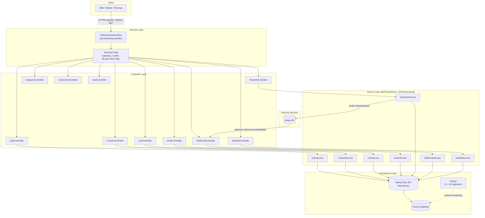
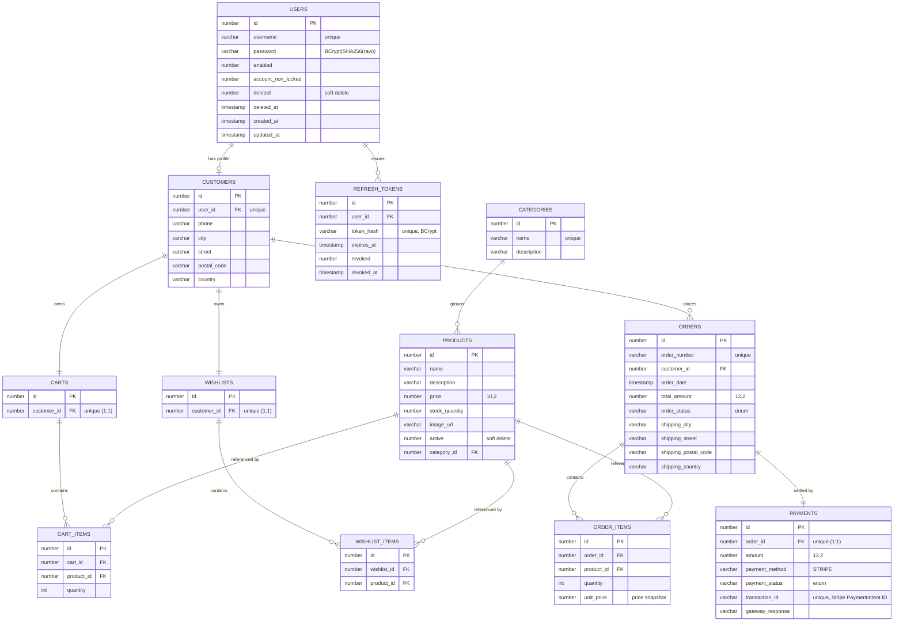
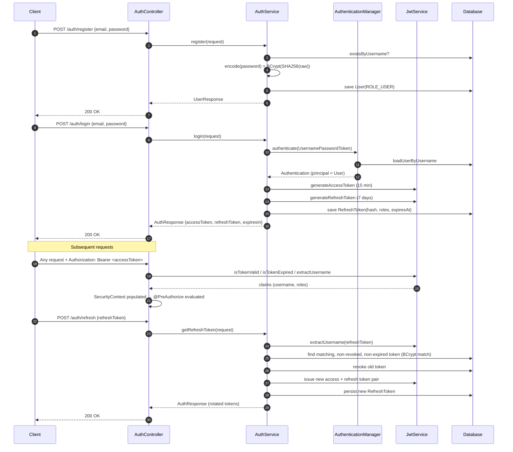
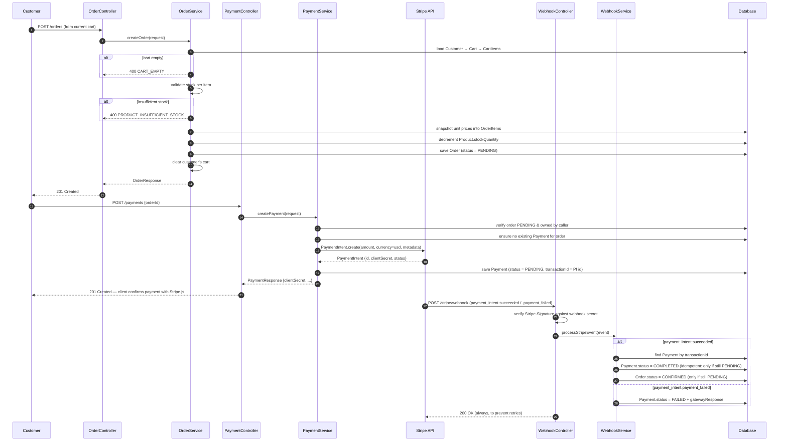
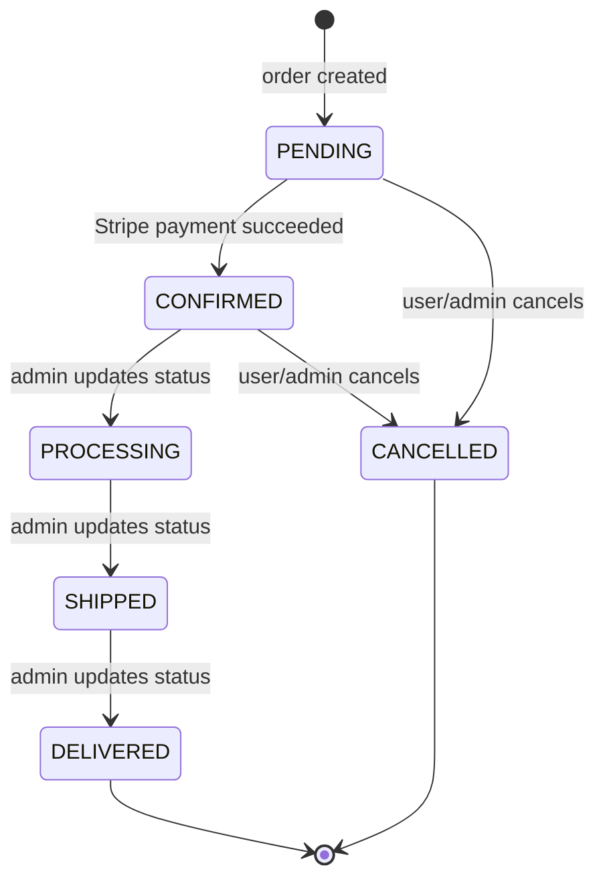

# Spring E-Commerce API

A full-featured e-commerce backend built with **Spring Boot 3.5 / Java 21**, featuring JWT authentication with refresh-token rotation, role-based authorization, Oracle persistence via Flyway-versioned migrations, Stripe payment processing with webhook reconciliation, and Docker Compose orchestration.

<p>
  
  
  
  
  
  
</p>

---

## Table of Contents

- [Overview](#overview)
- [Tech Stack](#tech-stack)
- [Architecture](#architecture)
- [Database Schema](#database-schema)
- [Authentication & Authorization Flow](#authentication--authorization-flow)
- [Order & Payment Flow](#order--payment-flow)
- [API Reference](#api-reference)
- [Error Handling](#error-handling)
- [Getting Started](#getting-started)
- [Configuration](#configuration)
- [Project Structure](#project-structure)
- [Roadmap](#roadmap)

---

## Overview

This API powers the backend of an e-commerce platform, covering the full customer journey from registration to checkout:

- **Identity** — user registration/login, JWT access + refresh tokens, BCrypt-over-SHA-256 password hashing
- **Catalog** — categories and products with soft-delete (`active` flag) and admin-only mutation
- **Shopping** — per-customer cart and wishlist, with wishlist → cart migration
- **Checkout** — order creation from cart with stock validation and price snapshotting
- **Payments** — Stripe PaymentIntent creation and asynchronous webhook reconciliation
- **Governance** — centralized error codes, JPA auditing (`created_by` / `updated_by`), method-level `@PreAuthorize` security

> **Note on scope:** the codebase here represents the implementation as committed. Two callouts worth knowing as a consumer of this README: a `redis` service is provisioned in `docker-compose.yaml` for future caching, but no Spring Data Redis dependency or `@Cacheable` usage exists in the code yet; and the server's `context-path` is `/api/v1`, so **every** endpoint below is actually reachable under that prefix regardless of each controller's own `@RequestMapping`.

---

## Tech Stack

| Concern | Technology |
|---|---|
| Language / Runtime | Java 21 |
| Framework | Spring Boot 3.5.14 |
| Security | Spring Security 6, JWT (`jjwt` 0.13.0), method-level `@PreAuthorize` |
| Persistence | Spring Data JPA / Hibernate, Oracle (`ojdbc11`) |
| Schema Migrations | Flyway (`flyway-database-oracle`) |
| Object Mapping | MapStruct 1.6.3 |
| Payments | Stripe Java SDK 26.1.0 |
| API Docs | springdoc-openapi (Swagger UI) |
| Build | Maven |
| Containerization | Docker, Docker Compose (app + Oracle XE + Redis) |
| Testing | JUnit 5, Spring Boot Test |

---

## Architecture

The codebase follows a classic layered architecture: controllers expose REST endpoints, delegate to services that own transactions and authorization rules, which in turn operate on JPA repositories and entities. DTOs and MapStruct mappers keep the persistence model decoupled from the wire format.


```mermaid
flowchart TB
    subgraph Client["Client"]
        C[Web / Mobile / Postman]
    end

    subgraph Security["Security Layer"]
        F["JwtAuthenticationFilter\n(OncePerRequestFilter)"]
        SC["SecurityConfig\n(stateless, CORS, BCrypt+SHA-256)"]
    end

    subgraph Web["Controller Layer"]
        AC[AuthController]
        PC[ProductController]
        CC[CartController]
        OC[OrderController]
        PAYC[PaymentController]
        WHC[WebhookController]
        WLC[WishlistController]
        CatC[CategoryController]
        CustC[CustomerController]
        UC[UserController]
    end

    subgraph Service["Service Layer  (@PreAuthorize + @Transactional)"]
        AS[AuthService]
        PS[ProductService]
        CS[CartService]
        OS[OrderService]
        PAYS[PaymentService]
        WHS[WebhookService]
        WLS[WishlistService]
    end

    subgraph Data["Persistence Layer"]
        REPO[(Spring Data JPA Repositories)]
        DB[(Oracle Database)]
        FLY["Flyway\nV1...V9 migrations"]
    end

    subgraph External["External Services"]
        STRIPE[("Stripe API")]
    end

    C -->|HTTPS request + Bearer JWT| F
    F --> SC
    SC --> AC & PC & CC & OC & PAYC & WHC & WLC & CatC & CustC & UC

    AC --> AS
    PC --> PS
    CC --> CS
    OC --> OS
    PAYC --> PAYS
    WHC --> WHS
    WLC --> WLS

    AS & PS & CS & OS & PAYS & WHS & WLS --> REPO
    REPO --> DB
    FLY -.->|schema versioning| DB

    PAYS -->|create PaymentIntent| STRIPE
    STRIPE -->|payment_intent.succeeded/failed| WHC
```

**Key design choices observed in the code:**
- **Stateless JWT auth** — `SessionCreationPolicy.STATELESS`; every request is authenticated independently via `JwtAuthenticationFilter`.
- **Defense in depth** — both URL-level rules in `SecurityConfig` (`/auth/**`, Swagger paths are public; everything else requires authentication) **and** method-level `@PreAuthorize` checks in the service layer (e.g., `hasRole('ADMIN')`, ownership checks like `#id == authentication.principal.id`).
- **Soft delete** — `User` (`@SQLRestriction("deleted = false")`) and `Product` (`@Where(clause = "active = true")`) use Hibernate row filters instead of hard deletes.
- **Auditing** — `BaseEntity` + `AuditorProvider` automatically stamp `created_at/by` and `updated_at/by` on every entity via Spring Data JPA Auditing.

---

## Database Schema

Schema is fully managed via **Flyway migrations** (`V1` → `V9`), targeting Oracle. Below is the entity-relationship diagram reconstructed from the migration scripts and JPA entity mappings.


```mermaid
erDiagram
    USERS ||--o| CUSTOMERS : "has profile"
    USERS ||--o{ REFRESH_TOKENS : "issues"
    CUSTOMERS ||--|| CARTS : "owns"
    CUSTOMERS ||--|| WISHLISTS : "owns"
    CUSTOMERS ||--o{ ORDERS : "places"
    CATEGORIES ||--o{ PRODUCTS : "groups"
    CARTS ||--o{ CART_ITEMS : "contains"
    PRODUCTS ||--o{ CART_ITEMS : "referenced by"
    WISHLISTS ||--o{ WISHLIST_ITEMS : "contains"
    PRODUCTS ||--o{ WISHLIST_ITEMS : "referenced by"
    ORDERS ||--o{ ORDER_ITEMS : "contains"
    PRODUCTS ||--o{ ORDER_ITEMS : "referenced by"
    ORDERS ||--|| PAYMENTS : "settled by"

    USERS {
        number id PK
        varchar username "unique"
        varchar password "BCrypt(SHA256(raw))"
        number enabled
        number account_non_locked
        number deleted "soft delete"
        timestamp deleted_at
        timestamp created_at
        timestamp updated_at
    }

    REFRESH_TOKENS {
        number id PK
        number user_id FK
        varchar token_hash "unique, BCrypt"
        timestamp expires_at
        number revoked
        timestamp revoked_at
    }

    CUSTOMERS {
        number id PK
        number user_id FK "unique"
        varchar phone
        varchar city
        varchar street
        varchar postal_code
        varchar country
    }

    CATEGORIES {
        number id PK
        varchar name "unique"
        varchar description
    }

    PRODUCTS {
        number id PK
        varchar name
        varchar description
        number price "10,2"
        number stock_quantity
        varchar image_url
        number active "soft delete"
        number category_id FK
    }

    CARTS {
        number id PK
        number customer_id FK "unique (1:1)"
    }

    CART_ITEMS {
        number id PK
        number cart_id FK
        number product_id FK
        int quantity
    }

    WISHLISTS {
        number id PK
        number customer_id FK "unique (1:1)"
    }

    WISHLIST_ITEMS {
        number id PK
        number wishlist_id FK
        number product_id FK
    }

    ORDERS {
        number id PK
        varchar order_number "unique"
        number customer_id FK
        timestamp order_date
        number total_amount "12,2"
        varchar order_status "enum"
        varchar shipping_city
        varchar shipping_street
        varchar shipping_postal_code
        varchar shipping_country
    }

    ORDER_ITEMS {
        number id PK
        number order_id FK
        number product_id FK
        int quantity
        number unit_price "price snapshot"
    }

    PAYMENTS {
        number id PK
        number order_id FK "unique (1:1)"
        number amount "12,2"
        varchar payment_method "STRIPE"
        varchar payment_status "enum"
        varchar transaction_id "unique, Stripe PaymentIntent ID"
        varchar gateway_response
    }
```

**Notable schema details:**
- `cart_items` and `wishlist_items` enforce a `UNIQUE(parent_id, product_id)` constraint, preventing duplicate line items.
- `payments.order_id` and `payments.transaction_id` are both unique — one payment per order, one record per Stripe PaymentIntent.
- `order_items.unit_price` is a **price snapshot** taken at order time, so historical orders are unaffected by later catalog price changes.
- All tables inherit `created_at`, `updated_at`, `created_by`, `updated_by` from the `BaseEntity` auditing pattern.

---

## Authentication & Authorization Flow

JWT-based, stateless authentication with short-lived access tokens and rotating, hashed refresh tokens.


```mermaid
sequenceDiagram
    autonumber
    participant U as Client
    participant AC as AuthController
    participant AS as AuthService
    participant AM as AuthenticationManager
    participant JS as JwtService
    participant DB as Database

    U->>AC: POST /auth/register {email, password}
    AC->>AS: register(request)
    AS->>DB: existsByUsername?
    AS->>AS: encode(password) = BCrypt(SHA256(raw))
    AS->>DB: save User(ROLE_USER)
    AS-->>AC: UserResponse
    AC-->>U: 200 OK

    U->>AC: POST /auth/login {email, password}
    AC->>AS: login(request)
    AS->>AM: authenticate(UsernamePasswordToken)
    AM->>DB: loadUserByUsername
    AM-->>AS: Authentication (principal = User)
    AS->>JS: generateAccessToken (15 min)
    AS->>JS: generateRefreshToken (7 days)
    AS->>DB: save RefreshToken(hash, roles, expiresAt)
    AS-->>AC: AuthResponse {accessToken, refreshToken, expiresIn}
    AC-->>U: 200 OK

    Note over U,AC: Subsequent requests
    U->>AC: Any request + Authorization: Bearer <accessToken>
    AC->>JS: isTokenValid / isTokenExpired / extractUsername
    JS-->>AC: claims (username, roles)
    AC->>AC: SecurityContext populated → @PreAuthorize evaluated

    U->>AC: POST /auth/refresh {refreshToken}
    AC->>AS: getRefreshToken(request)
    AS->>JS: extractUsername(refreshToken)
    AS->>DB: find matching, non-revoked, non-expired token (BCrypt match)
    AS->>DB: revoke old token
    AS->>JS: issue new access + refresh token pair
    AS->>DB: persist new RefreshToken
    AS-->>AC: AuthResponse (rotated tokens)
    AC-->>U: 200 OK
```

**Authorization model:**

| Mechanism | Where | Example |
|---|---|---|
| Stateless filter chain | `SecurityConfig` | `/auth/**`, `/swagger-ui/**`, `/v3/api-docs/**` public; everything else requires a valid JWT |
| Role-based | `@PreAuthorize("hasRole('ADMIN')")` | Category/Product create/update/delete, order status updates |
| Ownership-based | `@PreAuthorize("#id == authentication.principal.id")` | A user can fetch/update/delete only **their own** account or customer profile (admins bypass via `or hasRole('ADMIN')`) |
| Resource ownership (service-level) | manual checks in service methods | `PaymentService` / `OrderService` verify the authenticated customer owns the order before exposing payment/order data |

Two application roles exist: **`ROLE_ADMIN`** and **`ROLE_USER`** (see `Role` enum).

---

## Order & Payment Flow

Checkout is cart-driven: an order snapshots the cart's contents and prices, then a Stripe `PaymentIntent` is created against that order. Stripe's webhook is the source of truth for whether the payment — and therefore the order — actually succeeded.


```mermaid
sequenceDiagram
    autonumber
    participant U as Customer
    participant OC as OrderController
    participant OS as OrderService
    participant PC as PaymentController
    participant PS as PaymentService
    participant Stripe as Stripe API
    participant WHC as WebhookController
    participant WHS as WebhookService
    participant DB as Database

    U->>OC: POST /orders  (from current cart)
    OC->>OS: createOrder(request)
    OS->>DB: load Customer → Cart → CartItems
    alt cart empty
        OS-->>OC: 400 CART_EMPTY
    end
    OS->>OS: validate stock per item
    alt insufficient stock
        OS-->>OC: 400 PRODUCT_INSUFFICIENT_STOCK
    end
    OS->>DB: snapshot unit prices into OrderItems
    OS->>DB: decrement Product.stockQuantity
    OS->>DB: save Order (status = PENDING)
    OS->>OS: clear customer's cart
    OS-->>OC: OrderResponse
    OC-->>U: 201 Created

    U->>PC: POST /payments {orderId}
    PC->>PS: createPayment(request)
    PS->>DB: verify order PENDING & owned by caller
    PS->>DB: ensure no existing Payment for order
    PS->>Stripe: PaymentIntent.create(amount, currency=usd, metadata)
    Stripe-->>PS: PaymentIntent {id, clientSecret, status}
    PS->>DB: save Payment (status = PENDING, transactionId = PI id)
    PS-->>PC: PaymentResponse {clientSecret, ...}
    PC-->>U: 201 Created — client confirms payment with Stripe.js

    Stripe->>WHC: POST /stripe/webhook  (payment_intent.succeeded / .payment_failed)
    WHC->>WHC: verify Stripe-Signature against webhook secret
    WHC->>WHS: processStripeEvent(event)
    alt payment_intent.succeeded
        WHS->>DB: find Payment by transactionId
        WHS->>DB: Payment.status = COMPLETED (idempotent: only if still PENDING)
        WHS->>DB: Order.status = CONFIRMED (only if still PENDING)
    else payment_intent.payment_failed
        WHS->>DB: Payment.status = FAILED + gatewayResponse
    end
    WHC-->>Stripe: 200 OK  (always, to prevent retries)
```

**Order status lifecycle** enforced by `OrderService.isValidTransition`:


```mermaid
stateDiagram-v2
    [*] --> PENDING : order created
    PENDING --> CONFIRMED : Stripe payment succeeded
    PENDING --> CANCELLED : user/admin cancels
    CONFIRMED --> PROCESSING : admin updates status
    CONFIRMED --> CANCELLED : user/admin cancels
    PROCESSING --> SHIPPED : admin updates status
    SHIPPED --> DELIVERED : admin updates status
    DELIVERED --> [*]
    CANCELLED --> [*]
```

> Cancelling an order (`PENDING` or `CONFIRMED` only, for non-admins) restores stock quantities for every line item.

---

## API Reference

All routes are served under the global context path **`/api/v1`** (e.g. the route documented as `POST /auth/register` is actually `POST /api/v1/auth/register`).

Interactive documentation is available via Swagger UI once the app is running: **`/api/v1/swagger-ui.html`**.

### Auth — `/auth` *(public)*

| Method | Endpoint | Description |
|---|---|---|
| POST | `/auth/register` | Register a new user (`ROLE_USER`) |
| POST | `/auth/login` | Authenticate, receive access + refresh tokens |
| POST | `/auth/refresh` | Rotate an access/refresh token pair |

### Users — `/users` *(self or `ADMIN`)*

| Method | Endpoint | Description |
|---|---|---|
| GET | `/users` | List users (paginated) |
| GET | `/users/{id}` | Get user by ID |
| PUT | `/users/{id}` | Update user |
| DELETE | `/users/{id}?passwordConfirmation=` | Delete user (requires password confirmation) |

### Customers — `/customers`

| Method | Endpoint | Description |
|---|---|---|
| POST | `/customers` | Create customer profile for the authenticated user |
| GET | `/customers` | List customers (`ADMIN`) |
| GET | `/customers/{id}` | Get customer (self or `ADMIN`) |
| PUT | `/customers/{id}` | Update customer (self or `ADMIN`) |

### Categories — `/categories`

| Method | Endpoint | Auth | Description |
|---|---|---|---|
| GET | `/categories` | any authenticated | Paginated list |
| GET | `/categories/{id}` | any authenticated | Get by ID |
| POST | `/categories` | `ADMIN` | Create |
| PUT | `/categories/{id}` | `ADMIN` | Update name/description |
| DELETE | `/categories/{id}` | `ADMIN` | Delete (fails if products are attached) |

### Products — `/products`

| Method | Endpoint | Auth | Description |
|---|---|---|---|
| GET | `/products` | any authenticated | Paginated list |
| GET | `/products/{id}` | any authenticated | Get by ID |
| POST | `/products/{id}` | `ADMIN` | Create product |
| PUT | `/products/{id}` | `ADMIN` | Update product |
| DELETE | `/products/{id}` | `ADMIN` | Soft-delete (deactivate) product |
| GET | `/products/search` | any authenticated | Search by criteria (name, category, price range) |

### Cart — `/carts` *(`ROLE_USER`)*

| Method | Endpoint | Description |
|---|---|---|
| GET | `/carts` | Get the authenticated customer's cart |
| POST | `/carts/items` | Add a product to the cart |
| PUT | `/carts/items/{id}` | Update line-item quantity |
| DELETE | `/carts/items/{id}` | Remove a line item |
| DELETE | `/carts` | Clear the entire cart |

### Wishlist — `/wishlist` *(`ROLE_USER`)*

| Method | Endpoint | Description |
|---|---|---|
| GET | `/wishlist` | Get the authenticated customer's wishlist |
| POST | `/wishlist/items` | Add a product to the wishlist |
| DELETE | `/wishlist/items/{itemId}` | Remove a wishlist item |
| POST | `/wishlist/items/{itemId}/move-to-cart` | Move an item from wishlist to cart |

### Orders — `/orders`

| Method | Endpoint | Auth | Description |
|---|---|---|---|
| POST | `/orders` | `ROLE_USER` | Create an order from the current cart |
| GET | `/orders` | `ADMIN` | List all orders, optional `?status=` filter |
| GET | `/orders/my-orders` | `ADMIN`/`USER` | List the authenticated customer's orders |
| GET | `/orders/{id}` | `ADMIN`/`USER` (owner) | Get order detail |
| PUT | `/orders/{id}/status` | `ADMIN` | Transition order status |
| PUT | `/orders/{id}/cancel` | `ADMIN`/owner | Cancel order (restores stock) |

### Payments — `/payments`

| Method | Endpoint | Auth | Description |
|---|---|---|---|
| POST | `/payments` | `ROLE_USER` | Create a Stripe PaymentIntent for a `PENDING` order |
| GET | `/payments/{id}` | `ADMIN`/owner | Get payment by ID |
| GET | `/payments/order/{orderId}` | `ADMIN`/owner | Get payment by order ID |

### Stripe Webhook — `/stripe` *(public, signature-verified)*

| Method | Endpoint | Description |
|---|---|---|
| POST | `/stripe/webhook` | Receives `payment_intent.succeeded` / `payment_intent.payment_failed` events |

---

## Error Handling

All exceptions are funneled through a single `@RestControllerAdvice` (`GlobalExceptionHandler`) into a consistent JSON shape:

```json
{
  "success": false,
  "errorCode": "PROD-004",
  "message": "Insufficient stock available for the requested product",
  "detailedMessage": "...",
  "timestamp": "2026-06-24T10:15:30",
  "path": "/api/v1/orders",
  "fieldErrors": { "quantity": "must be greater than 0" }
}
```

| Exception | HTTP Status | Trigger |
|---|---|---|
| `MethodArgumentNotValidException` | 400 | `@Valid` request body validation failure |
| `EcommerceAppException` (+ subclasses `ResourceNotFoundException`, `DuplicateResourceException`) | varies (mapped from `ErrorCode`) | Domain/business rule violations |
| `AccessDeniedException` | 403 | `@PreAuthorize` denial |
| `BadCredentialsException` | 401 | Invalid login credentials |
| `Exception` (catch-all) | 500 | Unexpected/unhandled errors |

Error codes are namespaced by domain — `AUTH-*`, `CUS-*`, `CAT-*`, `PROD-*`, `CARD-*`, `WISH-*`, `ORD-*`, `PAY-*`, `VAL-*`, `SYS-*` — making client-side error handling predictable and grep-able.

---

## Getting Started

### Prerequisites

- JDK 21+
- Maven (or use the bundled `mvnw` wrapper)
- Docker & Docker Compose (recommended — provisions Oracle XE + Redis alongside the app)
- A Stripe account (test mode) for `STRIPE_API_KEY` / webhook secret, if exercising the payment flow

### Run with Docker Compose

```bash
git clone https://github.com/alaa-333/spring-ecommerce-api.git
cd spring-ecommerce-api

# optional: override defaults
export DB_PASSWORD=your_password
export JWT_SECRET=your_jwt_secret
export STRIPE_API_KEY=sk_test_xxx

docker compose up --build
```

This starts three services: the Spring Boot app (`:8080`), Oracle XE (`:1521`), and Redis (`:6379`, reserved for future caching).

### Run locally with Maven

```bash
# Requires a running Oracle instance — point env vars at it
export DB_URL=jdbc:oracle:thin:@//localhost:1521/XEPDB1
export DB_USERNAME=ecommerce
export DB_PASSWORD=dev_password
export JWT_SECRET=your_jwt_secret

./mvnw clean package -DskipTests
./mvnw spring-boot:run
```

The API will be available at `http://localhost:8080/api/v1`, with Swagger UI at `http://localhost:8080/api/v1/swagger-ui.html`.

### Run tests

```bash
./mvnw test
```

---

## Configuration

Key environment variables (see `application-dev.yml` / `application-prod.yml`):

| Variable | Description | Dev Default |
|---|---|---|
| `DB_URL` | Oracle JDBC URL | `jdbc:oracle:thin:@//localhost:1521/XEPDB1` |
| `DB_USERNAME` | DB username | `ecommerce` |
| `DB_PASSWORD` | DB password | `dev_password` |
| `JWT_SECRET` | HMAC signing key for JWTs | dev placeholder (⚠️ override in prod) |
| `STRIPE_API_KEY` | Stripe secret key | — |
| `stripe.webhook-secret` | Stripe webhook signing secret | — (signature check is skipped with a warning if unset) |

Access tokens expire after **15 minutes**; refresh tokens after **7 days** (both configurable via `jwt.expiration` / `jwt.refresh-expiration`).

Active Spring profile is controlled by `SPRING_PROFILES_ACTIVE` (`dev` enables SQL logging and `ddl-auto: validate`; `prod` tunes the HikariCP pool and silences SQL logs).

---

## Project Structure

```
src/main/java/com/ecommerce/api/
├── config/          # Security, OpenAPI, JPA auditing configuration
├── controller/       # REST controllers (one per resource)
├── dto/
│   ├── request/      # Inbound request payloads, grouped by domain
│   └── response/      # Outbound response payloads
├── entity/            # JPA entities + enums (OrderStatus, PaymentStatus, Role, PaymentMethod)
├── exception/         # Domain exceptions, ErrorCode catalog, global handler
├── mapper/             # MapStruct entity ↔ DTO mappers
├── repository/         # Spring Data JPA repositories
├── security/           # JwtService, JwtAuthenticationFilter
└── service/             # Business logic, transactions, @PreAuthorize rules

src/main/resources/
├── db/migration/      # Flyway SQL migrations (V1–V9)
├── application.yaml    # Shared config (context-path, JPA batching)
├── application-dev.yml  # Dev profile (Oracle, JWT secret, verbose logging)
└── application-prod.yml # Prod profile (HikariCP tuning, quiet logging)
```